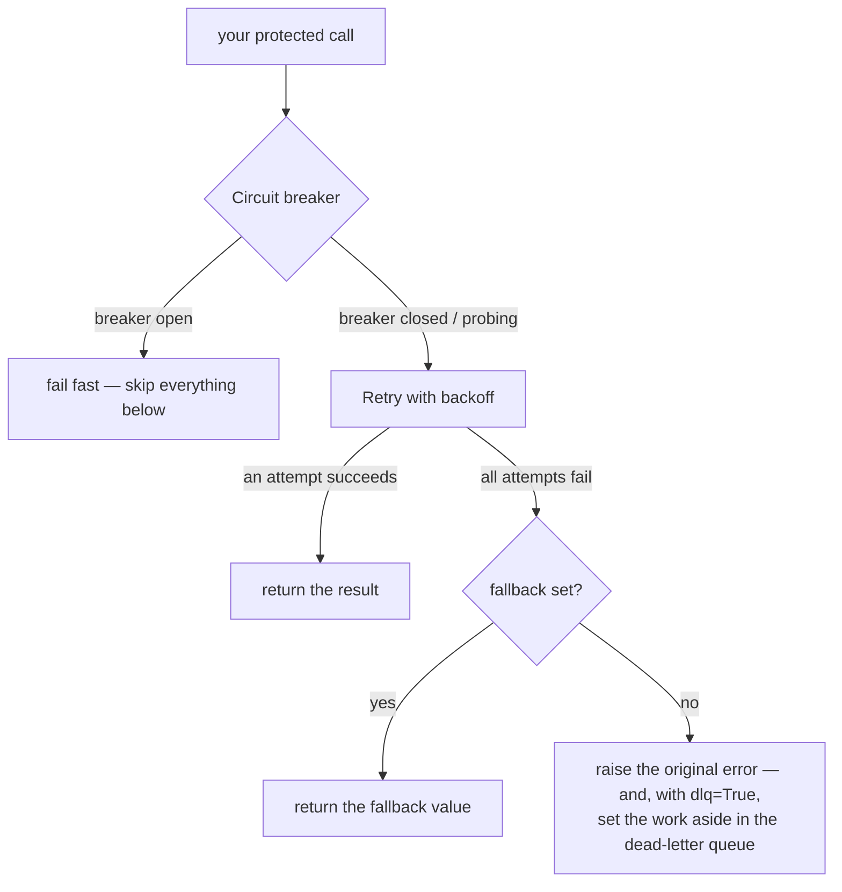

# How `@baldur.protected` composes circuit breaker, retry, and fallback

> One decorator layers circuit breaker, retry, fallback, and a dead-letter queue into a single pipeline — in the order that keeps them working together instead of against each other.

## What is it?

Each self-healing pattern handles one kind of failure. A **circuit breaker** stops calling a
dependency that is already down. A **retry** rides out a fleeting blip. A **fallback** returns a
safe answer when a call cannot succeed. A **dead-letter queue** sets aside work that must not be
lost. Each is useful on its own, but in practice you rarely want just one, and the order you
combine them in changes how they behave.

Wiring them by hand means nesting several wrappers around every call, in exactly the right order,
in every project. Get the order wrong and they undercut each other.

`@baldur.protected` is Baldur's **facade**: a single decorator (with a `baldur.protect()` function
form for wrapping a callable inline) that composes these patterns into one pipeline around your
function. You declare *"protect this call"* once and opt individual patterns in by keyword; Baldur
owns the layering.

```python
import baldur


@baldur.protected("charge-customer", retry=True, fallback=lambda: {"status": "queued"})
def charge(order_id: str) -> dict:
    return payment_gateway.charge(order_id)
```

## Why it matters

The patterns only protect you if they are layered in the right order, and the right order is not
obvious:

- **Retry must sit *inside* the circuit breaker.** If you retry on the outside, you keep hammering
  a dependency the breaker has already judged to be down, burning your retry budget and piling
  load onto a failing service. With the breaker outermost, an open breaker fails the call *fast*
  and the retries never run.
- **Fallback must be the *last* resort.** If the fallback runs before retry, a one-off blip that
  the very next attempt would have survived gets served the degraded answer instead. With fallback
  innermost, retry gets its chance first.

`@baldur.protected` fixes this order once, correctly, so every protected call in your codebase gets
the same proven layering. You never re-derive the nesting, and you reason about one entry point
instead of several hand-rolled wrappers.

## How it works in Baldur

A protected call runs through the patterns from the outside in. The breaker is checked first and
can short-circuit everything below it; the fallback is the innermost safety net; and a final
failure can be copied into the dead-letter queue on the way out.



Because the breaker is outermost, an open breaker fails the call fast: retry and fallback are
skipped entirely, so you never burn retry attempts or run a fallback against a dependency that is
already known to be down.

### What's on by default

The bare `@baldur.protected("name")` gives you the **circuit breaker only**. Every other pattern is
something you opt into; Baldur stays a thin facade rather than turning on machinery you did not ask
for:

| Pattern | On by default? | How you control it |
|---------|----------------|--------------------|
| Circuit breaker | **Yes** | `circuit_breaker=False` to turn it off |
| Retry with backoff | No | `retry=True` |
| Fallback | No | pass `fallback=<callable>` |
| Dead-letter queue (PRO) | No | `dlq=True` |
| Timeout (wall-clock bound) | No | pass `timeout=<seconds>` |
| Idempotency (dedup) | No | pass `idempotency_key=...` |

So the full pipeline from the diagram is simply what you get once you opt the pieces in:

```python
@baldur.protected("charge-customer", retry=True, fallback=give_up, dlq=True)
def charge(order_id: str) -> dict:
    ...
```

### One name ties it together

The first argument, the `name`, is the call's identity across Baldur. It is the circuit
breaker's key, the retry domain, and the label your metrics are grouped under. Keep it **stable and
one-per-downstream** (`"charge-customer"`, `"inventory-lookup"`) so the breaker state and the
dashboards line up with the dependency they describe.

### Decorator or function

`@baldur.protected` decorates a function and auto-detects whether it is sync or async. When you
would rather wrap a callable inline (or protect only one call inside a larger function), use the
`baldur.protect()` function form:

```python
result = baldur.protect(
    "charge-customer", lambda: payment_gateway.charge(order_id), retry=True
)
```

Both share the same keywords. If you need to inspect the outcome (was the fallback used? how many
attempts?) without catching an exception, `protect_with_meta()` (and its async counterpart
`aprotect_with_meta()`) returns a `ProtectResult` instead of raising.

### Composed, honestly

- **Retry does not make your call safe to repeat.** A retry runs your function again, side effects
  and all, so a retried charge can charge twice. Pass `idempotency_key=` (or make the function
  idempotent yourself) when the work is not naturally safe to repeat. Baldur will not silently
  assume it is. See [Idempotency](../oss/idempotency.md).
- **The dead-letter queue is a PRO feature.** You can pass `dlq=True` on an OSS install, but the
  queue's storage ships with **PRO** — without it, a final failure is not captured, so the work is
  not set aside for later. With **PRO**, `dlq=True` durably records every failed operation, nothing
  is lost across restarts, and you can replay or redrive the backlog once the dependency recovers.
  See [DLQ + Replay](../pro/dlq-replay.md).
- **On `async def` functions**, fallback, dead-letter, idempotency, and timeout compose today.
  Circuit breaker and retry are not available on async yet, and if you request them on an async
  call, Baldur raises a clear error rather than pretending to protect it. (Use `@baldur.aprotected`
  for async-only callsites.) That is the framework's rule: when it cannot do something, it says so
  loudly instead of failing silent.

## Configuration

You configure the facade **per call**, through the keyword arguments shown above. A per-call keyword
always takes precedence, and keeping the switches at the call site means the protection a function
has is visible right where it is defined.

The patterns the facade composes each carry their own settings — the circuit breaker's thresholds,
retry's backoff, idempotency's storage — documented in their own guides and listed in the
[environment variable reference](../../reference/env-vars.md).

## See also

- [Getting Started](../../getting-started/index.md) — get a protected endpoint running in five minutes
- [What is self-healing?](self-healing.md) — the bigger picture this fits into
- [Circuit Breaker](../oss/circuit-breaker.md) — the outermost layer, and a good first read
- [Retry](../oss/retry.md) — the retry-with-backoff stage
- [Idempotency](../oss/idempotency.md) — make a retried side effect safe to repeat
- [DLQ + Replay](../pro/dlq-replay.md) — the PRO durable dead-letter queue
- [Facade API reference](../../reference/baldur/facade.md) — every option and signature
