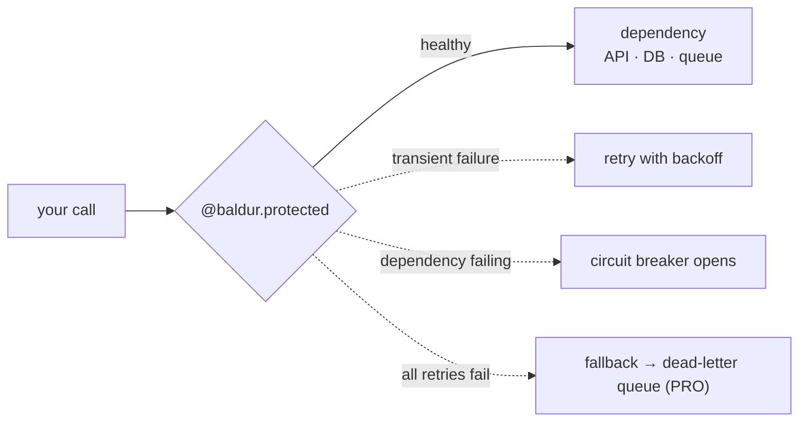

# What is self-healing?

> Software that recovers from the failures of the things it depends on — automatically, without paging you for every incident.

## What is it?

Every application leans on things that can fail: a payment gateway times out, a database gets
slow, an external API starts returning errors. Traditionally, surviving those failures means
writing defensive code by hand in every project, and getting woken up when you get it wrong.

**Self-healing** is the practice of building that survival in once, so the application detects a
failure and responds to it on its own: it stops hammering a dependency that is down, retries a
request that failed for a fleeting reason, falls back to a safe answer, and sets aside work it
cannot finish yet instead of dropping it. Like a body closing a cut without being told to, a
self-healing app keeps running through trouble and recovers when the trouble passes — instead of
falling over and waiting for a human.

In Baldur, self-healing is a **reliability layer** you add to your Python app: circuit breaker,
retry, fallback, and dead-letter queue, composed behind a single decorator.

## Why it matters

The failures that actually hurt happen *inside* your service, in the code path of a single call:
a double-charged customer, one slow dependency dragging down every request, a payment lost to a
transient error. Handling them well has always meant hand-rolling the same breaker, the same
backoff, and the same dead-letter plumbing in every project, and getting it right every time.

Without a self-healing layer, that work either does not get done or gets done inconsistently, and
the cost shows up at the worst possible time:

- **One slow dependency takes down the whole app.** Doomed calls pile up, threads and connections
  drain, and a single failing service makes *your* service look unhealthy to its callers too.
- **Transient blips become customer-visible errors.** A failure that would have succeeded on the
  very next attempt is surfaced to the user instead of being quietly retried.
- **Work gets lost.** A request that fails after a side effect (a charge, a write) leaves you
  with no record to retry and no way to reconcile.
- **A human is the recovery mechanism.** Every incident becomes a page, a manual restart, a
  scramble to replay by hand.

A self-healing layer turns those into contained, automatic, recoverable events.

## How it works in Baldur

You wrap a call with the `@baldur.protected` facade, one decorator that runs a circuit breaker by
default and lets you opt in retry and a fallback:

```python
import baldur


@baldur.protected("charge-customer", retry=True, fallback=lambda: {"status": "queued"})
def charge(order_id: str) -> dict:
    return payment_gateway.charge(order_id)
```

From then on, Baldur watches that call and responds to failure automatically:



- A **transient** failure is retried with backoff, so a one-off blip never reaches the user.
- A **failing** dependency trips the circuit breaker, so your app stops hammering it and fails
  fast instead of hanging.
- When a call still cannot succeed, a **fallback** runs so the caller still gets a safe answer
  instead of an error. With PRO's durable **dead-letter queue**, work that must not be lost
  is set aside to replay later instead of dropped.

Adoption stays cheap because there is nothing to stand up and nothing new to learn:

- **Zero infrastructure to start.** With no configuration, Baldur runs on an in-memory fallback —
  no Redis, no Docker, no environment variables. Add Redis only when you scale to multiple
  processes. It is a library, not a sidecar or a separate service.
- **One API across frameworks.** The same `@baldur.protected` works on Django, FastAPI, and Flask.

**Self-healing, honestly.** Baldur automates the failure responses it is designed for. It does
not fix bugs in your code or guarantee your app never fails. Its job is to keep your app
responsive and your data safe *through* a failure, and to recover automatically once the
dependency comes back. For a failure it cannot safely resolve on its own, Baldur's rule is to make
it **loud, not silent**: the failure is surfaced (and, in a production setup, escalated to a
human) rather than swallowed. Self-healing where it can; a clear hand-off where it cannot.

### The patterns it gives you

Each pattern handles one kind of failure for you. Start with the free OSS building blocks:

| When this happens | Baldur's response | Guide |
|-------------------|-------------------|-------|
| A dependency starts failing | Trip the breaker, fail fast, then probe for recovery | [Circuit Breaker](../oss/circuit-breaker.md) |
| A call fails for a fleeting reason | Retry with backoff | [Retry](../oss/retry.md) |
| A request might run twice (a retry, a double-click) | Run the side effect only once | [Idempotency](../oss/idempotency.md) |
| A load balancer asks "are you healthy?" | Answer truthfully so traffic routes around you | [Health Check](../oss/health-check.md) |
| The process is told to shut down | Drain in-flight work before exiting | [Graceful Shutdown](../oss/graceful-shutdown.md) |

There is more in the free tier too: [Metrics](../oss/metrics.md),
[System Control](../oss/system-control.md), and [Precomputed Cache](../oss/precomputed-cache.md).

### Free to start, production-grade when you need it

The OSS patterns above are free and enough to get hooked. When you run Baldur in production for a
team, **PRO** adds the heavier machinery: a durable
[dead-letter queue with replay](../pro/dlq-replay.md) that captures failed work so nothing is
lost, an [audit trail](../pro/audit.md), [bulkhead](../pro/bulkhead.md) isolation,
[canary recovery](../pro/canary-recovery.md), and self-monitoring that
[escalates to a human](../pro/meta-watchdog.md) when Baldur itself gets stuck.

## See also

- [Getting Started](../../getting-started/index.md) — get a protected endpoint running in five minutes
- [Circuit Breaker](../oss/circuit-breaker.md) — the most fundamental pattern, and a good first read
- [Environment Variables](../../reference/env-vars.md) — the complete operator-tunable list
- [API Reference](../../reference/index.md) — every option and signature
