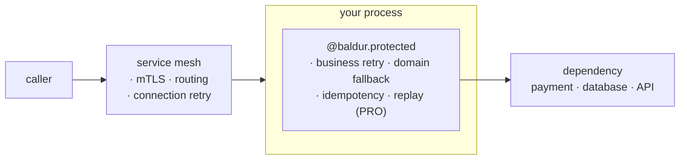

# Baldur and your service mesh

> If you run a service mesh, this is where Baldur fits: the mesh protects the network between your services, and Baldur protects the logic inside each one — they are built to run together.

## What is it?

A **service mesh** (Istio, Linkerd, Consul, or a cloud equivalent) is infrastructure that manages
the *network* between your services. It runs a small proxy (a "sidecar") next to each service and
takes over the traffic: encrypting connections (mTLS), routing requests, enforcing timeouts, and
retrying calls that drop at the connection level. You get all of that without touching application
code.

Baldur is not a mesh, and not a competitor to one. It is a **library that runs inside your
application process**, wrapping individual calls with circuit breaker, retry, fallback, and (with
PRO) durable recovery. The mesh works on the wire, *between* processes; Baldur works in the code,
*inside* one.

So the relationship is simple: **your mesh secures the network; Baldur makes the code survive
failure.** They overlap a little and complement a lot.

## Why it matters

If you already run a mesh, it is fair to ask: *the mesh already does retries, timeouts, and circuit
breaking — why add anything in the app?*

The answer is structural. A sidecar sits **beside** your process, on the network path. It sees the
bytes flowing past (TCP connections, HTTP methods, status codes) but it cannot see *into* the call
it is proxying. It does not know which exception your function raised, whether two requests are the
same logical operation, what a sensible fallback value would be, or that a half-finished order needs
to be unwound. Those facts exist only **inside the process**, in your code's own types and state.

That boundary is exactly where the failures that hurt the most live:

- A retry at the network layer re-sends a request blind, so a retried charge can **bill the customer
  twice**, because the wire has no idea the two attempts are the same payment.
- When a call fails for good, the sidecar can return a 503 or route elsewhere, but it cannot hand the
  caller a **useful domain answer**: a cached price, a "queued" status.
- Once a request is gone, it is gone: the mesh keeps **no memory** of work it failed to deliver, so
  there is nothing to replay when the dependency comes back.

A mesh closes the network-shaped gaps. Baldur closes the code-shaped ones.

## How it works in Baldur

Both layers wrap the same request at different points. The mesh wraps the **network hop** between
processes; Baldur wraps the **call** inside the process.



The mesh owns everything the network needs — encryption, service-to-service auth, load balancing,
and re-establishing a dropped connection. Baldur owns four things a sidecar structurally cannot
reach, because they exist only inside your process:

| The sidecar can't reach this (it sits on the network) | Baldur supplies it (it runs in your code) |
|--------------------------------------------------------|-------------------------------------------|
| **Visibility** — a proxy sees an HTTP status, not your call. It can't tell a retryable error from a fatal one, or know this request belongs to a critical-tier customer. | Baldur's decisions read the actual exception and the call's business context — order, customer, tier — which it pulls from the call site automatically (a `PolicyContext`). |
| **Semantics** — the wire retries a request blind; it has no idea two attempts are the *same* operation, so a retried charge double-charges. | Idempotency keyed to *your* business identifier, so a repeated operation runs its side effect once. |
| **Action** — on failure a proxy can only error out or reroute; it can't compute a domain answer. | A fallback returns a safe, domain-specific value, so the caller still gets a useful response. |
| **State** — a proxy is stateless per request: once a call fails for good, the work is gone. | **With PRO:** failed work is captured and replayed when the dependency recovers — or a half-finished, multi-step operation is unwound. |

Two of these you reach through the same facade you would use anyway — by business key, both opt-in:

```python
import baldur


@baldur.protected(
    "charge-customer",
    retry=True,
    idempotency_key="order_id",
    fallback=lambda: {"status": "queued"},
)
def charge(order_id: str) -> dict:
    return payment_gateway.charge(order_id)
```

`idempotency_key="order_id"` makes the dedup key *your* order id — the thing the network can't see —
so a retried call charges once. `fallback=` hands the caller a domain answer when the charge can't
go through. Capturing and replaying failed work durably is the
[dead-letter queue](../pro/dlq-replay.md), a PRO capability.

### Running both, without fighting

The one place a mesh and Baldur can step on each other is **retries**: if the mesh retries 3× and
Baldur retries 3× on the *same* failure, one logical call can hit the dependency 9 times. The fix is
a single principle, **one signal, one owner**:

- Let the **mesh** retry **network-level** failures (a dropped connection, a TCP reset) that never
  reach your code.
- Let **Baldur** retry **application-level** failures (a specific exception, a business error) that
  the mesh can only see as an opaque 5xx.

Set up this way the two layers add rather than multiply: the mesh keeps the connection healthy,
Baldur keeps the call meaningful, and neither duplicates the other's work. The same split applies to
circuit breaking — trip on connection health in the mesh, trip on business-error rate in Baldur.

## See also

- [What is self-healing?](self-healing.md) — the problem Baldur exists to solve
- [Composing with @baldur.protected](composition.md) — the one decorator these patterns live behind
- [Idempotency](../oss/idempotency.md) — make a retried operation safe to repeat, by business key
- [DLQ + Replay](../pro/dlq-replay.md) — the PRO durable capture-and-replay for failed work
- [Getting Started](../../getting-started/index.md) — protect an endpoint in five minutes
