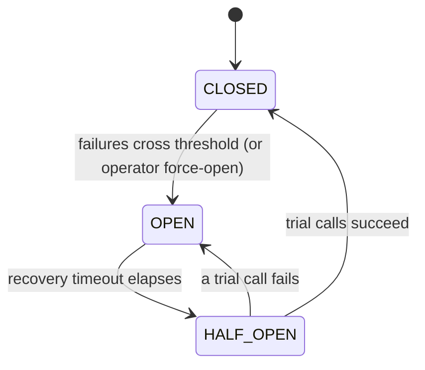

# Circuit Breaker

> Stops your app from hammering a failing dependency, so one slow service can't drag the rest down with it.

## What is it?

When a service you depend on (a payment gateway, a database, an external API) starts failing,
the worst thing your app can do is keep calling it. Every doomed request ties up a thread or a
connection while it waits to time out, and those pile up until your own app grinds to a halt. The
failure spreads upward instead of staying contained.

A **circuit breaker** borrows the idea from household electrical wiring: when it detects trouble, it
"trips" and cuts the connection. While the breaker is tripped, calls fail instantly instead of
hanging, which gives the struggling dependency room to recover and keeps your app responsive. After a
cool-down it cautiously tests whether the dependency is healthy again, and only then restores normal
traffic. In Baldur this is the **Circuit Breaker**, the most fundamental of the resilience patterns.

## Why it matters

The failure a circuit breaker prevents is **cascading failure**: the domino effect where one unhealthy
dependency exhausts your app's threads and connection pool, which then makes *your* service look
unhealthy to *its* callers, and so on up the chain. A breaker turns a slow, resource-draining failure
into a fast, contained one:

- **Fail fast.** Once the breaker is open, calls return immediately instead of blocking on a timeout.
- **Give the dependency room.** Pausing traffic lets an overloaded service catch up instead of being
  kept underwater by retries.
- **Recover automatically.** The breaker probes for recovery on its own and reopens at the first sign
  the dependency is still broken, so you don't have to babysit it.

## How it works in Baldur

You wrap a call with the `@baldur.protected` facade (which combines the breaker with retry and
fallback) or the `circuit_breaker` decorator directly. From then on, Baldur tracks that call's health
and moves the breaker through three observable states:

- **CLOSED** is the normal state: calls flow straight through.
- **OPEN** is the tripped state: calls are rejected instantly, without reaching the dependency.
- **HALF_OPEN** is the probing state: after the cool-down, a few trial calls are allowed through to
  test the waters.

| What you observe | When it happens |
|------------------|-----------------|
| Calls pass straight through | **CLOSED** — the dependency is healthy |
| Calls are rejected instantly, without touching the dependency | **OPEN** — failures crossed the threshold (or an operator forced it open) |
| A handful of trial calls are let through | **HALF_OPEN** — the recovery timeout elapsed and Baldur is probing whether the dependency recovered |
| Normal traffic resumes | a trial call succeeds enough times → back to **CLOSED** |
| The breaker snaps back to rejecting | a single trial call fails → straight back to **OPEN** |

How the breaker decides to trip, and who can override that, comes with a few wrinkles:

- **Low-traffic services won't trip on noise.** The breaker requires a minimum number of calls in the
  window before it will open, so a single early failure on a barely-used endpoint can't flip it.
- **Rate-limit storms trip it too.** A burst of HTTP 429 (Too Many Requests) responses from a
  dependency is treated as a failure signal and can open the breaker, so your app stops amplifying the
  overload.
- **Operators stay in control.** You can force a breaker open (`force_open_circuit`) to take a
  dependency out of rotation during maintenance, force it closed (`force_close_circuit`) once you know
  it has recovered, or hand control back to automatic mode at any time.

### Get notified when it trips

Set a Slack webhook URL and Baldur posts to your channel the moment a breaker
opens, then again when it recovers: a 🔴 when traffic is cut and a 🟢 when it is
restored. This is the one notification the OSS tier delivers on its own, and it
works on the most minimal install, with no message broker or background worker
running. Set `BALDUR_META_WATCHDOG_SLACK_WEBHOOK_URL` to turn it on; the URL
lives under the self-monitoring namespace, but on OSS the circuit-breaker push is
what reads it. Leave it unset and the open and close events are still logged,
just not posted.

The OSS push is deliberately plain: one message per transition, with no grouping
or rate-limiting, so a breaker that flaps posts every time. Deduplication,
cooldown, multi-channel routing, and on-call escalation belong to [Unified
Notification](../pro/unified-notification.md) on PRO. The [OSS vs PRO tier
model](../foundations/tier-model.md) lays out the full split.

### Across a cluster (PRO)

By default each worker (or pod) keeps its own breaker. If a dependency starts
failing, every worker has to independently rack up failures before its breaker
trips — so the struggling dependency keeps taking doomed traffic from each worker
that hasn't caught up yet, and the cluster protects itself unevenly.

On PRO, with the event bus running on its Redis backend, the moment one worker's
breaker opens that OPEN is broadcast to every peer worker, which applies it to its
own breaker within a fraction of a second. The matching CLOSED fans out the same
way on recovery. Peers flip without crossing their own failure threshold, so the
whole cluster stops hammering the dependency together instead of one worker at a
time. It is opt-in — set `BALDUR_CB_CLUSTER_STATE_PROPAGATION_ENABLED=true` on each
worker. This coordinates the *same* breaker across workers; coordinating
*different* breakers, so an open downstream breaker tightens the upstream ones, is
a separate PRO capability (Circuit Mesh).

## Configuration

The most common knobs an operator sets. The full list lives in the API reference.

| Env Var | Default | What it controls |
|---------|---------|------------------|
| `BALDUR_CB_FAILURE_THRESHOLD` | `5` | How many failures in the window trip the breaker from CLOSED to OPEN |
| `BALDUR_CB_RECOVERY_TIMEOUT` | `60` | Seconds the breaker stays OPEN before letting trial calls through |
| `BALDUR_CB_HALF_OPEN_MAX_CALLS` | `3` | How many trial calls are allowed through while probing for recovery |
| `BALDUR_EVENT_LOGGING_CB_LOG_LEVEL` | `WARNING` | Log level for circuit state-change events |
| `BALDUR_META_WATCHDOG_SLACK_WEBHOOK_URL` | _(unset)_ | Slack incoming-webhook URL for the open/close push; unset means the events are logged, not posted |

## See also

- [Getting Started](../../getting-started/index.md) — set it up
- [Circuit Breaker API Reference](../../reference/services/circuit_breaker.md) — full options and signatures
- [Environment Variables](../../reference/env-vars.md) — the complete operator-tunable list
