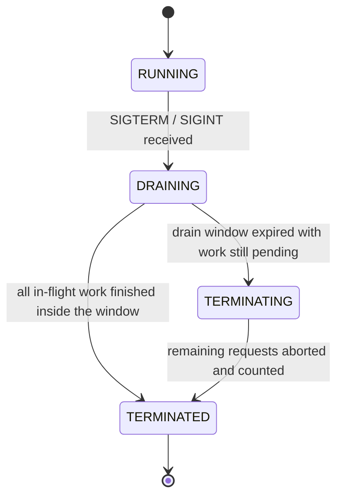

# Graceful Shutdown

> When your platform tells the app to stop, Baldur finishes the requests already in flight,
> lets its own subsystems flush their work, and only then lets the process exit — so a deploy
> never drops a user mid-request.

## What is it?

Every deployment, scale-down, or node rotation ends the same way: the platform tells your
process to stop. On Kubernetes that is a `SIGTERM`, followed after a grace period by a hard
kill. A process that exits the instant it is told drops whatever it was doing — requests in
flight turn into errors, and buffered work (audit records, queued events) simply vanishes.

Think of closing a restaurant: you lock the front door first, let the seated guests finish
their meals, and only then turn off the lights. **Graceful shutdown** is that sequence for a
server process: stop accepting new work, finish the work already started, then exit. In Baldur
this is the **Graceful Shutdown** feature: a coordinator that runs the whole sequence for your
HTTP requests *and* for every Baldur subsystem at the same time.

## Why it matters

Without coordination, every deploy is a small, self-inflicted incident:

- **Dropped requests.** In-flight requests die mid-transaction, so users see errors exactly as
  often as you ship. "We deploy on Fridays" becomes a reliability statement.
- **Lost work.** Buffered audit records and pending events never get flushed if nothing waits
  for them before exit.
- **Killed mid-cleanup.** A health check that goes dark during shutdown tells the orchestrator
  the pod is dead, which triggers the hard kill, interrupting the very cleanup that was
  in progress.

Baldur's coordinator removes all three at once:

- **Zero-downtime deploys.** New traffic is turned away with an explicit "retry shortly"
  answer while existing requests run to completion.
- **One drain for everything.** Your requests and Baldur's own subsystems (audit logging,
  event dispatch, background workers) share a single drain window, so nothing is forgotten.
- **Bounded, never hung.** The drain has a hard time limit. If something refuses to finish,
  Baldur force-terminates anyway and reports exactly how many requests were cut off, instead
  of hanging until the orchestrator kills it blind.

## How it works in Baldur

The coordinator starts together with Baldur itself and registers handlers for `SIGTERM` and
`SIGINT`, so the platform's stop signal is the trigger — no extra wiring. (You can also start a
drain programmatically through the coordinator returned by `get_shutdown_coordinator()`.) From
there the process moves through four observable phases:

| What you observe | When it happens |
|------------------|-----------------|
| New requests get `503` with a `Retry-After` header and `Connection: close` | The drain has begun. The Django integration installs this rejection middleware by default; `Retry-After` carries the remaining drain time, and `Connection: close` makes load-balancer pools stop reusing the worker's connections |
| Liveness and ping endpoints keep answering `200` | Draining is a normal lifecycle phase, not a failure — keeping liveness green prevents Kubernetes from hard-killing the pod mid-drain. Readiness, by contrast, reports not-ready so new traffic routes elsewhere |
| The process stays up while in-flight requests finish | The coordinator re-checks every half-second until every tracked request and every participating subsystem reports done, then the process exits — standalone, by re-delivering the platform's stop signal the conventional way; under gunicorn or uvicorn, through the server's own lifecycle |
| `baldur_shutdown_phase` metric moves `0 → 1 → 3` | A clean drain: running, draining, terminated — nothing was lost |
| `baldur_shutdown_phase` reaches `2` and `baldur_shutdown_aborted_requests_total` increments | The drain window (30 seconds by default) expired with work still pending. The remainder was aborted, and the counter tells you exactly how much |
| `baldur_shutdown_drain_duration_seconds` histogram records the drain | Every shutdown reports how long it actually took — worth an alert if it creeps toward the window limit |

A few operational details:

- **The drain is bounded on purpose.** A clean drain loses nothing; a forced one tells you
  precisely what was lost (`baldur_shutdown_aborted_requests_total`, plus the count of requests
  successfully drained in `baldur_shutdown_drained_requests_total`). An unbounded "wait until
  done" would just trade dropped requests for a pod the orchestrator eventually kills blind.
- **Subsystems drain too.** Baldur's own components (audit logging flushing its buffered
  records, event dispatch finishing queued events, background workers) register as drain
  participants. The shutdown completes only when the requests *and* the participants are done,
  all inside the same window.
- **On Kubernetes**, set the pod's `terminationGracePeriodSeconds` comfortably above the drain
  window, so the platform's hard kill never lands before Baldur's own deadline does.
- **Under gunicorn**, the master process owns worker signals, so Baldur plugs into gunicorn's
  worker lifecycle instead of registering its own handlers — wire the provided hooks in your
  gunicorn config (see the [gunicorn adapter reference](../../reference/adapters/gunicorn.md)),
  and keep gunicorn's `--graceful-timeout` at or above the drain window. Baldur logs an explicit
  warning when it detects gunicorn without the hooks, so a missed wiring is visible rather
  than silent.

## Configuration

Graceful Shutdown works out of the box: the coordinator and its signal handlers start together
with Baldur, the Django rejection middleware is installed by default, and the drain window
defaults to 30 seconds. There are no graceful-shutdown variables in the operator-tunable
allowlist — there is nothing you need to set. The complete operator-tunable list lives in the
[environment variables reference](../../reference/env-vars.md).

## See also

- [Getting Started](../../getting-started/index.md) — set it up
- [Health Check](health-check.md) — how liveness and readiness answer during a drain
- [Gunicorn adapter reference](../../reference/adapters/gunicorn.md) — wiring the worker-lifecycle hooks
- [Environment Variables](../../reference/env-vars.md) — the complete operator-tunable list
