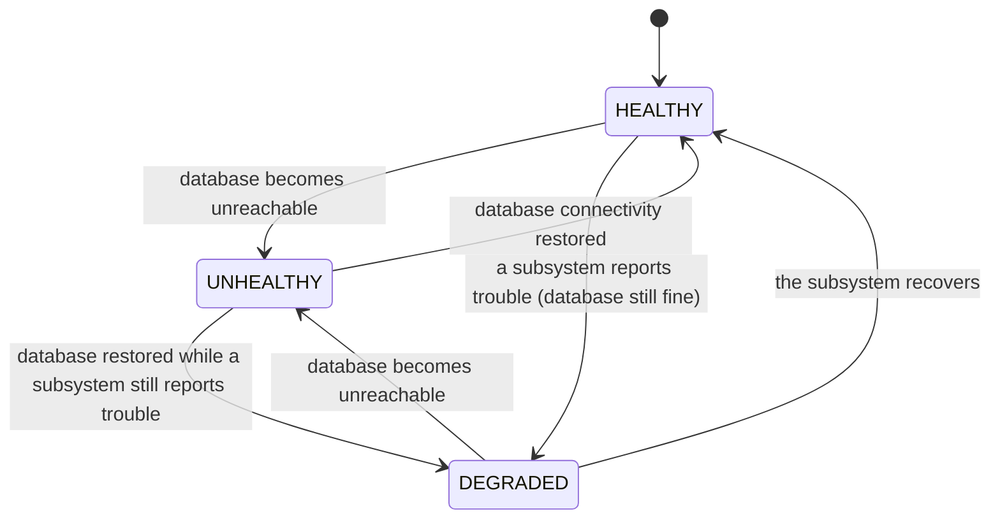

# Health Check

> Ready-made health endpoints that tell your load balancer and Kubernetes exactly when to send
> traffic to a pod — and when to stop.

## What is it?

Orchestrators and load balancers constantly ask every instance of your app two different questions:
*"are you alive?"* (should I restart you?) and *"are you ready?"* (should I send you traffic?).
Think of an aircraft: "is the engine running" and "is it cleared for passengers" are separate
checks with separate consequences: confusing them means either restarting a plane that just
needed a minute, or boarding passengers onto one that can't fly.

A **health check** endpoint answers those questions over HTTP, with the response code doing the
talking: `200` means "all good", `503` means "act on it". In Baldur this is the **Health Check**
feature: a set of pre-built endpoints that answer with full awareness of what the self-healing
layer knows: database connectivity, connection-pool state, and the health of the resilience
subsystems themselves.

## Why it matters

Most teams hand-roll a `/health` view, and it usually fails in one of two directions:

- **It checks too little.** It returns `200` unconditionally, so the load balancer keeps routing
  traffic to a pod whose database connection is gone.
- **It checks too much.** It runs expensive checks on every probe, so the health endpoint itself
  becomes a load source when a balancer polls it several times a second.

Baldur's Health Check removes both failure modes:

- **Correct routing decisions.** Only genuine unhealthiness (a severed database connection)
  returns `503` and takes the pod out of rotation. A pod that is degraded-but-serving stays in.
- **Cheap under polling.** The full health verdict is served from a precomputed cache, and an
  ultra-light ping endpoint answers without touching the database at all.
- **Debuggable incidents.** The response is structured: a status verdict per component, the
  count of circuit breakers in play, and whether the self-healing automation is switched on,
  not just a bare "down".

## How it works in Baldur

Baldur exposes five endpoints, each answering a different question (shown under the conventional
`/api/baldur/` prefix; the same checks are also available on Baldur's built-in admin console for
deployments without a web framework):

| Endpoint | Question it answers | Response behavior |
|----------|--------------------|-------------------|
| `health/` | "What is the full picture?" | Overall status plus per-component detail. `200` for healthy/degraded, `503` for unhealthy |
| `health/live/` | "Is the process alive?" | Always `200` while the app runs — even during shutdown drain |
| `health/ready/` | "Can it serve traffic?" | `200` only when every configured database connection is usable; otherwise `503` |
| `health/pool/` | "How are the connection pools?" | `200` when healthy; `503` when degraded or erroring |
| `health/ping/` | "Fastest possible yes" | Always `200`, no database access — built for high-frequency load-balancer checks |

The overall verdict on `health/` moves through three observable statuses:

| What you observe | When it happens |
|------------------|-----------------|
| `"status": "healthy"`, HTTP `200` | The database is reachable and the self-healing subsystems report no trouble |
| `"status": "degraded"`, HTTP `200` — the pod **stays in rotation** | A self-healing subsystem reports trouble while the database is still fine. Degraded means "keep serving, but look into it" |
| `"status": "unhealthy"`, HTTP `503` — the load balancer depools the pod | The database connection is unusable. This is the only verdict that takes the pod out of traffic |
| Readiness flips to `503` | Any configured database connection is down — or the pod is draining during a graceful shutdown, so new traffic stops |
| Liveness and ping keep answering `200` during shutdown | Draining is a normal lifecycle phase, not a failure — keeping liveness green prevents the orchestrator from killing the pod mid-drain |

Four points worth understanding:

- **Degraded never depools.** Only `unhealthy` maps to `503` on the main endpoint (two rare
  internal-failure statuses, `error` and `unavailable`, also map to `503`). A degraded pod that can
  still serve correctly is deliberately kept in rotation — depooling healthy capacity because a
  background subsystem hiccupped would make an incident worse, not better.
- **The payload is a diagnosis, not a verdict.** Beyond the status, `health/` reports each
  component's state, how many circuit breakers Baldur is currently tracking, whether the
  self-healing automation is switched on, and a timestamp. The pool endpoint additionally
  carries the error message when its check fails.
- **Responses are cached on purpose.** The full verdict comes from a precomputed cache so that
  aggressive probe polling stays cheap. Append `?nocache=true` to force a fresh computation —
  the response then marks the cache as bypassed.
- **PRO self-monitoring enriches the verdict.** When Baldur's PRO-tier self-monitoring
  (Meta-Watchdog) is active, its findings appear in the health payload and a struggling subsystem
  it detects is what moves the overall status to degraded.

## Configuration

Health Check works out of the box: the admin-console checks start together with Baldur itself,
the `/api/baldur/` endpoints mount through your web framework's normal URL routing (see
[Getting Started](../../getting-started/index.md)), and there are no health-check variables in
the operator-tunable allowlist, so there is nothing you need to set. The one runtime control is
per-request: `?nocache=true` on `health/` to bypass the cache. The complete operator-tunable
list lives in the [environment variables reference](../../reference/env-vars.md).

## See also

- [Getting Started](../../getting-started/index.md) — set it up
- [Health & Pools API Reference](../../reference/interfaces/health_and_pools.md) — full options and signatures
- [Circuit Breaker](circuit-breaker.md) — the resilience state the health payload reports on
- [Environment Variables](../../reference/env-vars.md) — the complete operator-tunable list
