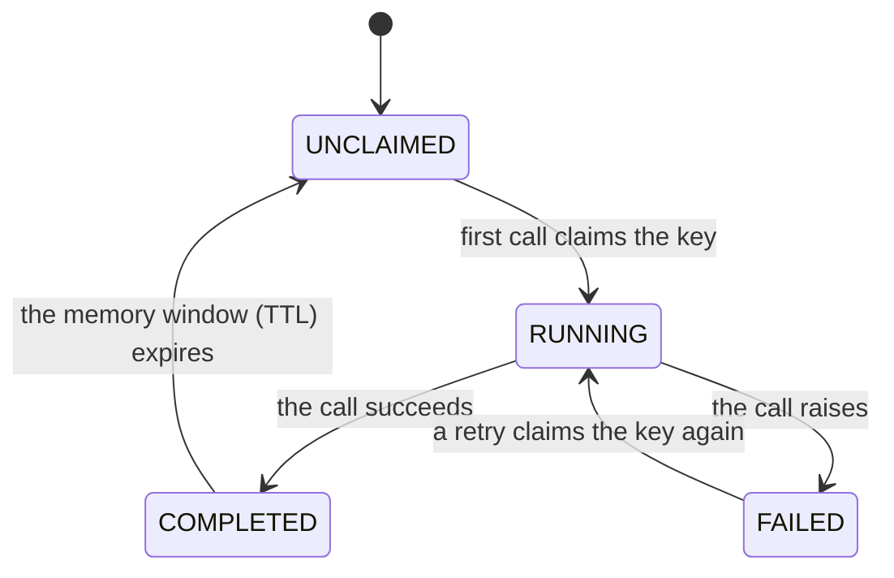

# Idempotency

> Makes "this must never happen twice" operations safe — a card charge, an email, a shipment — by remembering which requests have already run and blocking the repeats, even when retries, double-clicks, or duplicate webhooks fire the same request again.

## What is it?

An operation is *idempotent* when running it twice has the same effect as running it once. An
elevator call button is idempotent: pressing it five times still summons one elevator. Most
real-world side effects are not naturally like that — charge a card twice and the customer pays
twice.

The problem is that distributed systems *will* deliver the same request more than once. A user
double-clicks "Pay". A webhook provider redelivers an event it isn't sure you received. A retry
re-runs a call whose response was lost in transit even though the work itself succeeded. In Baldur,
**Idempotency** is key-based deduplication: you give each logical operation a key (such as the
order ID), Baldur remembers which keys it has already seen, and a second arrival of the same key is
blocked instead of executed again.

## Why it matters

- **Retry becomes safe.** Retry re-runs your function; that's its job (see the
  [Retry](retry.md) guide). For work that must not repeat, the dedup key is what makes
  at-least-once delivery safe: the retried call runs, the duplicated side effect doesn't.
- **Double-submits and duplicate webhooks are blocked, even concurrent ones.** The key is claimed
  atomically, so two requests racing in at the same instant can't both win. There is no
  check-then-act window for a duplicate to slip through.
- **No hand-rolled dedup.** The homegrown "look it up, then insert" check is exactly the racy
  pattern that fails under concurrency. Baldur replaces it with an atomic claim plus an explicit,
  catchable "already processed" error.
- **A failure doesn't poison the key.** If the first attempt raises, the key is released so a
  retry can run, and if several retries race for it, exactly one wins.

## How it works in Baldur

You attach a key to the operation on whichever surface fits:

- **Composed with the rest of the pipeline.** Pass `idempotency_key=` to the `@baldur.protected`
  facade (or its call forms `protect` / `aprotect`). A string names a field on the call's context
  (e.g. `"order_id"`); a callable builds a composite key. The dedup guard then runs in the same
  pipeline as the circuit breaker and retry.
- **Standalone decorator.** `@idempotent` wraps any sync or `async` function. Name the parameters
  that identify the request (`key_args=["order_id"]`) or supply a `key_fn=` for a custom key, and
  pick a domain to namespace it.
- **Programmatic.** `IdempotencyService` with `IdempotencyKey` gives you explicit
  check-then-mark control when a decorator doesn't fit (batch jobs, event consumers). Its
  contract is looser than the two surfaces above: a duplicate is reported in the returned
  result rather than raised, and because checking and marking are two separate steps, two
  callers racing on a not-yet-marked key can both pass the check. Reach for the facade or the
  decorator (or the service's distributed-lock helpers) when concurrent duplicates matter.

On the facade and decorator surfaces, the key's life is the same: the first call **claims** the
key atomically and runs. Success marks the key **completed**, and it is remembered for a memory
window (a TTL). A failure marks it **failed**, which releases it so a retry can claim it again.

| What you observe | When it happens |
|------------------|-----------------|
| The call runs normally | the key's first arrival — or a retry after a failed attempt |
| The duplicate is blocked with an "already processed" error | the same key arrives again after a successful run, within the memory window |
| The duplicate is blocked with an "another process is executing" error | the same key arrives while the first call is still running |
| The call is blocked with a "check unavailable" error | the dedup store could not be reached, under the default fail-closed posture |

A few things to get right:

- **Blocked means a clear error, not a silent skip.** A duplicate raises
  `IdempotencyDuplicateError` (the same error type on the facade and the decorator alike),
  telling you whether the original already completed or is still in flight. Baldur does *not* replay the original call's
  response — catch the error and treat it as "this work already happened."
- **Fail-closed by default.** Supplying a key is a "must not duplicate" signal, so if the dedup
  store can't be checked (say, a momentary network blip), the call is blocked with
  `IdempotencyUnavailableError` rather than risking a duplicate side effect. If availability
  matters more than the guarantee for a given call, you can opt that call (or the whole service)
  into fail-open, letting the unverifiable call proceed.
- **Cluster-wide with Redis.** The seen-keys ledger lives in your configured cache, so with Redis
  set up the same key is blocked across every worker and host. In production, an explicitly
  requested dedup gate with no shared cache configured fails loudly — the first call it guards
  raises a configuration error instead of silently degrading to per-worker memory. A dedup that
  only works within one process is a false promise.
- **The honest boundary.** Dedup is exactly-once for the duplicate and concurrent cases. If a
  process crashes *after* the side effect but *before* the completion mark, the key's claim
  eventually goes stale and a later retry may run the operation again, an essential
  at-least-once limit of any external dedup ledger. True end-to-end exactly-once requires a
  transactional outbox in the same datastore as your own side effect.
- **Pair it with your payment provider's own key.** When the side effect is a call to an
  external payment API, the crash window above has a practical fix: every major provider
  (Stripe, Adyen, PayPal, Toss Payments) accepts an idempotency key of its own and
  deduplicates on *its* side — and, unlike Baldur, replays the original response to a repeat.
  Derive that key deterministically from the business identifier (the order ID — never a
  random value generated per attempt), so a retry after a crash sends the *same* key and the
  provider recognizes the repeat. Baldur's dedup then covers your process — double-clicks,
  concurrent workers, duplicate webhooks — while the provider's key covers the in-doubt
  window Baldur cannot see.
- **Two windows, two knobs.** A key lives under two independent clocks. The *memory window* is
  how long a completed operation is remembered — how long duplicates stay blocked after success.
  It defaults to 30 minutes, is tunable globally with
  `BALDUR_IDEMPOTENCY_GATE_MEMORY_TTL_SECONDS`, and per call with `ttl=` on `@idempotent` or
  `idempotency_ttl=` on the facade (Stripe, for comparison, remembers for 24 hours). The
  *execution window* is how long a running claim is honored before a crashed attempt becomes
  retryable; it defaults to 30 minutes and is tuned per call with `execution_ttl=` /
  `idempotency_execution_ttl=`. Set the execution window to your operation's worst-case runtime
  — never to the dedup horizon — so a remember-for-hours key doesn't leave a crashed claim stuck
  for hours; a value *below* the true worst case risks a duplicate running concurrently once the
  claim goes stale. The programmatic check/mark API remembers for its own configurable TTL.
- **Keys are namespaced by domain and by operation.** Domains — `external_service`, `event`,
  `async_task`, and friends — keep the same order ID in two different domains from ever
  colliding. Within one domain, operations are told apart automatically: the facade's field-name
  form prefixes the protected service's name, and `@idempotent` keys include the decorated
  function's module-qualified name, so two different functions sharing `key_args=["order_id"]`
  and the same order ID each get their own verdict — charging order 1 never blocks shipping
  order 1. When two entry points really are one logical operation (an HTTP handler and a worker
  guarding the same charge), give both the same explicit `operation=` label. One caveat follows
  from the default being derived from the function's name: renaming or moving the function resets
  that operation's dedup memory at the deploy — set `operation=` explicitly for
  correctness-critical operations to make the identity rename-proof.
- **Rapid oscillation counts as duplication too.** An anti-flapping window applies the same idea
  to repeated *near-identical* changes: a value that keeps being re-applied within a short sliding
  window is treated as a duplicate, preventing automated adjustments from flip-flopping.

## Configuration

The most common knobs an operator sets. The full list lives in the API reference.

| Env Var | Default | What it controls |
|---------|---------|------------------|
| `BALDUR_IDEMPOTENCY_ENABLED` | `true` | Master switch — when `false`, every surface passes calls through with no dedup check |
| `BALDUR_IDEMPOTENCY_GATE_MEMORY_TTL_SECONDS` | `1800` | Default memory window (in seconds) on the decorator and facade surfaces — how long a completed operation keeps blocking duplicates when no per-call `ttl` is given |
| `BALDUR_IDEMPOTENCY_DEFAULT_CACHE_TTL` | `60` | How long (in seconds) the programmatic check/mark API remembers a processed operation |
| `BALDUR_REDIS_URL` | `redis://localhost:6379/0` | Points the seen-keys ledger at a shared Redis, so a duplicate key is blocked across all workers and hosts |

## See also

- [Retry](retry.md) — the companion pattern: retry re-runs the work; idempotency makes the re-run safe
- [Circuit Breaker](circuit-breaker.md) — the other resilience guard composed under `@baldur.protected`
- [Decorators API Reference](../../reference/decorators.md) — `@idempotent` and friends, full signatures
- [Environment Variables](../../reference/env-vars.md) — the complete operator-tunable list
- [Getting Started](../../getting-started/index.md) — set it up
