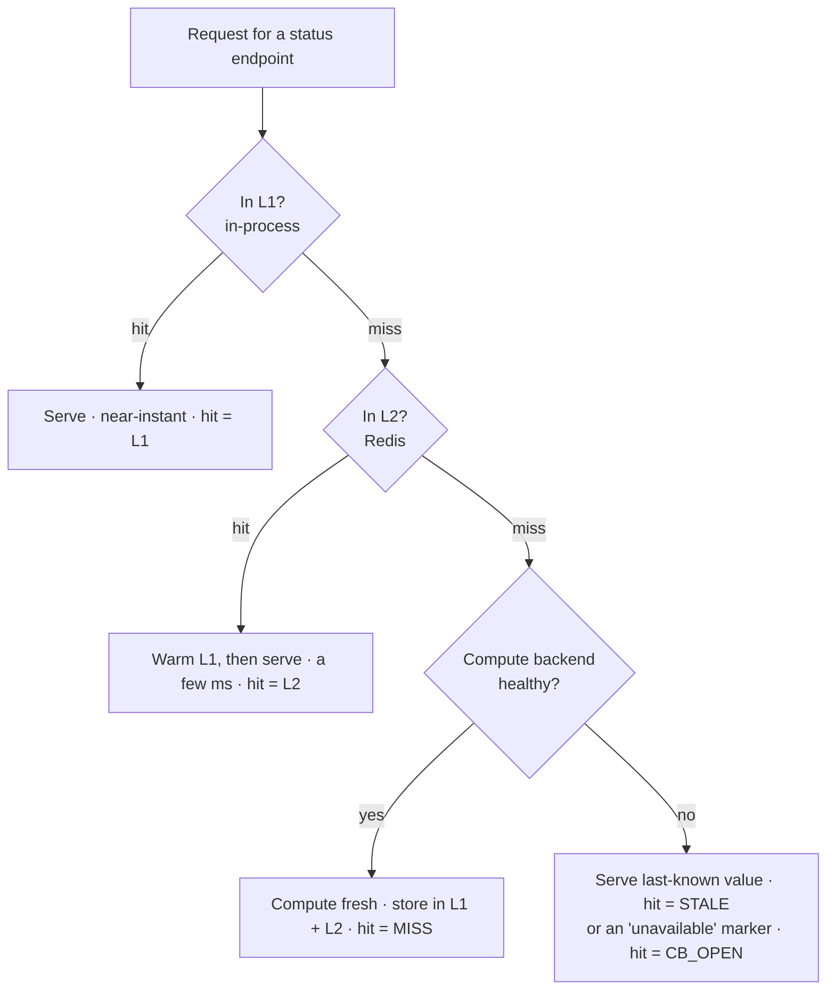

# Precomputed Cache

> Baldur answers its own status endpoints — the health check and connection-pool status — from a fast cache that is kept warm in the background, so monitoring traffic stays cheap and your app stays fast even when those endpoints are hit constantly.

## What is it?

Some endpoints are cheap to *call* but expensive to *answer*. Baldur's observability endpoints (the
health check and the connection-pool status) each gather live data that can take tens to a couple
hundred milliseconds to assemble. Paying that once is fine. But load
balancers, uptime monitors, and Kubernetes liveness/readiness probes hammer these endpoints every few
seconds, and recomputing the answer on every single request adds up fast.

A **precomputed cache** answers the question *before it is asked*. Instead of recomputing the status
fresh each time, Baldur keeps a recent answer ready and serves that, quietly recomputing it in the
background. It's the difference between cooking a meal to order and having it already plated when the
guest sits down.

Baldur calls this its **Precomputed Cache**: a three-tier cache (in-process → Redis → direct
compute) that keeps its observability endpoints answering in well under the time the raw computation
would take.

In OSS, the cache keeps two of these endpoints fast: the **health check** and the **connection-pool
status**. The **error-budget status** endpoint is a PRO feature — when PRO is active it rides this very
same cache, so it gets the identical speedup.

## Why it matters

This is the "your monitoring gets cheaper" payoff — turn it on and Baldur's most-polled status
endpoints answer from a warm cache in a millisecond or two, so health probes and dashboards stop
competing with your real traffic for database connections and CPU, with no caching code on your side.

- **Status endpoints stay fast under constant polling.** The health and pool-status responses come
  back from a warm cache in a millisecond or two instead of the tens-to-hundreds of milliseconds a
  fresh computation costs, keeping the overhead low even when a load balancer probes them every
  second.
- **Monitoring traffic stops being expensive.** Probes and dashboards that hit these endpoints no
  longer each trigger a full recompute, so they don't compete with real user traffic for database
  connections and CPU.
- **A slow or broken backend can't drag every probe down with it.** If the work behind an endpoint
  starts failing, the cache serves the last good answer (or a clear "unavailable" marker) instead of
  making every caller wait on the failure — your health checks keep responding quickly.
- **No extra moving parts.** The background refresh runs on a lightweight in-process timer — no
  Celery, no separate worker process, no new dependency to operate.
- **It fails open.** If Redis is down, or a refresh fails, or the cache layer is unavailable, the
  endpoints fall back to computing the answer directly. The cache makes things faster when it's
  healthy and simply gets out of the way when it isn't.

## How it works in Baldur

Three cache tiers are checked in order, fastest first, falling through to a direct computation only
when both caches are cold:

- **L1 (in-process).** An in-memory cache local to the process, with no network hop at all. Entries
  are held for a couple of seconds. This is the near-instant path.
- **L2 (Redis).** A pre-serialized JSON copy shared across every process and pod, answered in a
  millisecond or two. Entries live for about fifteen seconds. A hit here also warms L1 so the next
  request on this process skips Redis.
- **L3 (direct compute).** The real work. Only runs when both caches are cold; the fresh answer is
  then written back into L1 and L2 so the following requests are fast again.

**Every response is tagged with how it was served.** Each cached response carries a small cache tag
reporting which tier answered — its `hit` value — and how long it took — a `latency_ms` reading — so
you can see the cache working straight from the endpoint output:

| `hit` value in the response | What it means |
|-----------------------------|---------------|
| `"L1"` | Served from the in-process cache — the fastest path |
| `"L2"` | Served from Redis; the in-process cache was cold and has now been warmed |
| `"MISS"` | Both caches were cold, so the answer was computed fresh and cached |
| `"DEDUP"` | Another request was already computing the same answer; this caller shared that result instead of recomputing |
| `"STALE"` | The compute backend is unhealthy, so the last known-good answer was served |
| `"CB_OPEN"` | The backend is unhealthy and there was no prior answer to fall back on, so a clear "unavailable" marker was returned |
| `"ERROR"` | A fresh computation was attempted and raised before the circuit breaker had opened, so the failure was returned directly rather than a cached answer |

**A background worker keeps the cache warm.** Baldur runs a lightweight background loop that
recomputes all three snapshots on a short interval (shorter than the Redis entries' lifetime) so a
real request almost always lands on a warm tier instead of paying for a computation. The loop adds a
small random offset to its schedule so that many instances starting at once don't all recompute in
lockstep, and if a refresh cycle fails completely it backs off (with growing, jittered delays) before
trying again. Even without this worker the cache still fills itself on demand — the first request to a
cold endpoint computes and caches the answer, and the requests behind it ride the warm tiers — so the
worker is an optimization that keeps things warm proactively, not a prerequisite for caching to work.

**The compute path is circuit-breaker protected.** Computing a fresh answer is the slow, failure-prone
step, so Baldur guards it with a circuit breaker. After a few consecutive compute failures the
breaker opens, and while it's open Baldur stops calling the failing backend: it serves the last
known-good value (tagged `STALE`) if it has one, or a clear `"unavailable"` marker (tagged
`CB_OPEN`) if it doesn't. This keeps your probes answering quickly during an outage instead of every
caller queuing up behind a broken computation, and it gives the backend room to recover before Baldur
tries again.

**It watches for drift between the tiers.** Because the same answer lives in both the in-process cache
and Redis, the worker periodically compares the two copies for each endpoint. If they disagree it
records the inconsistency — as a consistency ratio, a metric, and a warning log — so a cache-coherence
problem surfaces instead of hiding.

**It degrades gracefully.** If Redis isn't available, the Redis tier is simply skipped and requests
fall through to the in-process cache and direct compute. If the optional fast-JSON library isn't
installed, Baldur uses the standard library instead. And if the background worker can't start, it
doesn't block your application from booting — the endpoints just compute their answers directly. The
cache is always a speed-up, never a new way for things to break.

## Configuration

Precomputed Cache is on by default and needs no setup to start working. It has no variables in the
operator-tunable allowlist — its tier lifetimes, refresh interval, and circuit-breaker thresholds are
advanced settings with production-safe defaults.

The one related setting most operators touch is where the shared L2 cache lives: the Redis tier
connects through `BALDUR_REDIS_URL`, the same Redis routing variable the rest of Baldur uses. With no
Redis configured, the cache runs on its in-process tier alone and still speeds up repeated requests
within each process.

| Env Var | Default | What it controls |
|---------|---------|------------------|
| `BALDUR_REDIS_URL` | `redis://localhost:6379/0` | Redis connection used by the shared L2 cache tier (and by the rest of Baldur) |

The complete operator-tunable list lives in the
[environment variables reference](../../reference/env-vars.md).

## See also

- [Getting Started](../../getting-started/index.md) — set it up
- [Health Check](health-check.md) — one of the endpoints this cache keeps fast
- [Circuit Breaker](circuit-breaker.md) — the protection wrapped around the compute path
- [Environment Variables](../../reference/env-vars.md) — the complete operator-tunable list
