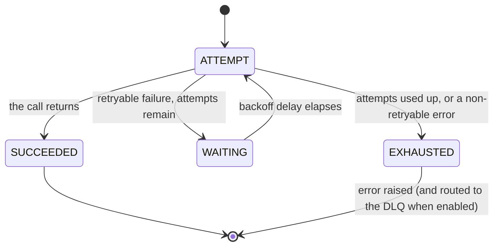

# Retry

> Automatically tries a failed operation again — with smart, growing pauses between attempts — so a brief hiccup doesn't turn into a user-facing error.

## What is it?

Many failures aren't permanent. A network blip, a database that was busy for a moment, a
dependency that briefly returned "too many requests" — the call failed not because the operation
was wrong, but because the world was busy for a second. The obvious fix is to just try again.

But a naive "loop and retry immediately" makes things worse: it hammers an already-struggling
dependency at the worst possible moment and can turn a momentary slowdown into a full outage. A
proper retry mechanism tries again *politely*: it waits a little before each new attempt, and
longer each time, so the struggling dependency gets room to recover. In Baldur this is **Retry**,
paired with a **Backoff** calculator that decides how long to wait between attempts.

## Why it matters

Retry removes the fragile, copy-pasted try/except/sleep/loop that ends up wrapped around every
flaky call, and gets subtly wrong every time:

- **Recover without a human in the loop.** Most transient faults clear within a couple of attempts;
  the user never sees the blip and no one gets paged.
- **Don't stampede the recovery.** Growing waits plus a touch of randomness ("jitter") stop a
  thousand simultaneously-failed requests from all retrying in the same instant and re-overloading
  the dependency the moment it comes back.
- **Know when *not* to retry.** A permanent error (bad input, or an already-open circuit breaker)
  is failed fast instead of wasting attempts on a call that cannot succeed.
- **Never lose the work.** When every attempt is used up, the failure isn't swallowed. It surfaces
  as an error, and with the Dead Letter Queue enabled the operation is preserved for inspection or
  later replay.

## How it works in Baldur

You wrap a call with the `@baldur.protected` facade (which combines retry with the circuit breaker
and a fallback), or apply the retry decorator directly — `@with_retry` for synchronous functions,
`@retried_async` for `async` ones. From then on, when the wrapped call raises a *retryable* error,
Baldur waits for a backoff delay and tries again, up to a configured maximum number of attempts,
each wait longer than the last.

A few things to keep in mind:

- **Backoff grows between attempts.** The pause before each retry increases so you don't hammer the
  dependency. Several strategies are available (exponential by default, plus linear, constant, and
  decorrelated jitter), and a random jitter is mixed in so failures that happen together don't all
  retry in lockstep.
- **Retryable vs. non-retryable.** Only transient errors are retried. A permanent failure (or an
  open circuit breaker) short-circuits straight to exhaustion instead of burning attempts on a call
  that can't succeed.
- **A retry re-runs your function, so it must be safe to run twice.** Baldur calls the operation
  again; it does not silently undo a partial side effect. For work that must never repeat
  (charging a card, sending a message), dedup the operation. Under `@baldur.protected`, pass
  `idempotency_key=` (a call field name such as `"order_id"`, or a callable for a composite key)
  to compose a dedup guard into the same pipeline; standalone, Baldur's separate `@idempotent`
  decorator blocks a duplicate execution of the same logical request. Either way, a second call
  carrying the same key is blocked instead of re-running the side effect.
- **Exhaustion is not silent.** When the last attempt fails, the failure surfaces to the caller as
  an error rather than being swallowed. `@with_retry` raises a clear "max retries exceeded" error,
  while `@baldur.protected` re-raises the original error (or runs your fallback, if you supplied
  one). With DLQ routing enabled, the failed operation is also preserved in the Dead Letter Queue
  (DLQ) for inspection or later replay.
- **DLQ routing is a PRO feature.** Retry and backoff are OSS; the Dead Letter Queue store that
  preserves an exhausted operation for later replay ships in the PRO package. Without it, an
  exhausted retry still surfaces the error to the caller. The operation simply isn't captured for
  replay.

| What you observe | When it happens |
|------------------|-----------------|
| The call is retried after a growing pause | a retryable error was raised and attempts remain |
| The call fails immediately, with no retry | the error is non-retryable (bad input, or an open circuit breaker) |
| An error is raised — and, when DLQ routing is enabled, the operation lands in the DLQ | every attempt was used up |
| The call succeeds with no error surfaced | a later attempt finally worked |

## Configuration

The most common knobs an operator sets. The full list lives in the API reference.

| Env Var | Default | What it controls |
|---------|---------|------------------|
| `BALDUR_RETRY_MAX_ATTEMPTS` | `3` | The maximum number of attempts before the operation is given up and the failure is raised |
| `BALDUR_RETRY_BASE_DELAY` | `1.0` | The starting backoff wait; later attempts wait progressively longer per the chosen strategy |
| `BALDUR_IDEMPOTENCY_ENABLED` | `true` | Whether Baldur's separate `@idempotent` dedup guard is active — when on, it blocks a duplicate execution of the same operation |

## See also

- [Getting Started](../../getting-started/index.md) — set it up
- [Decorators API Reference](../../reference/decorators.md) — `@with_retry` and other decorator signatures
- [Circuit Breaker](circuit-breaker.md) — the resilience pattern retry composes with under `@baldur.protected`
- [Environment Variables](../../reference/env-vars.md) — the complete operator-tunable list
