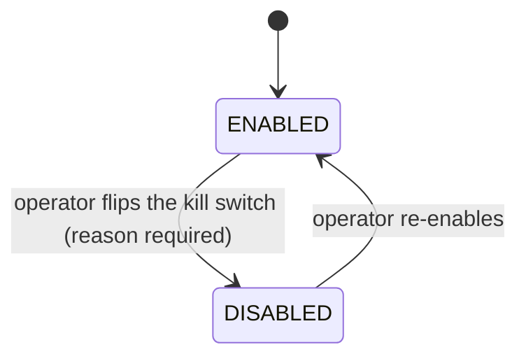
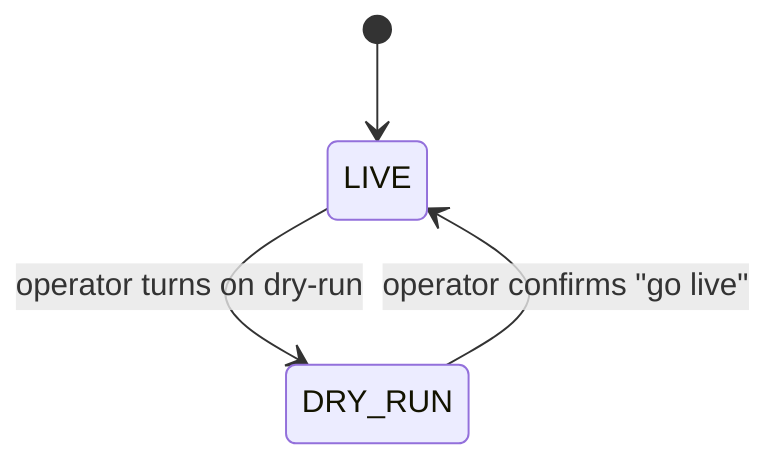

# System Control

> Two runtime safety controls for Baldur's self-healing: an instant kill switch that stops every automated intervention, and a dry-run mode that lets Baldur watch and report what it *would* do without acting. No redeploy — and the setting sticks across restarts and across servers.

## What is it?

When something goes wrong in production, automation that is normally helpful can occasionally make
an incident worse — retries pile onto an already-overloaded service, automated recovery fights the
human operator who is trying to stabilize things by hand. In those moments you want one thing: a big
red button that stops the automation *now*, without editing config files, redeploying, or restarting
the app.

**System Control** gives you two such runtime controls:

- A **kill switch**: a global on/off switch for Baldur's entire self-healing layer. Flip it off and
  Baldur stops taking automated action; flip it back on and normal self-healing resumes.
- A **dry-run (observe-only) mode**: a rehearsal switch. With dry-run on, Baldur keeps evaluating
  every situation exactly as it normally would, but instead of *acting* it records what it *would
  have* done. Think of it as a test flight: every instrument is live, but the controls aren't yet
  connected to the engines.

Both settings are stored durably, so they are remembered across restarts and, optionally, shared
across every server in your fleet.

## Why it matters

The kill switch is an incident-response tool; dry-run mode is an adoption tool. Together they remove
the two scariest moments of running automation in production: turning it on for the first time, and
turning it off in a hurry.

- **Instant, no deploy.** Disable automation at runtime through the admin console, the API, or a
  single function call. The change takes effect immediately — no restart, no redeploy.
- **It sticks across restarts.** The switch state is persisted. If you disable Baldur during an
  incident and a rolling restart or a crash happens, the system comes back up *still disabled* — it
  won't silently re-arm automation while you're still working the incident.
- **It can apply fleet-wide.** With the Redis-backed backend, flipping the switch on one node is
  seen by every node, so you don't have to disable Baldur server-by-server.
- **Every flip is accountable.** Disabling requires a reason, and each change records who did it,
  why, and when — so the incident timeline is intact afterward.
- **Try before you trust.** Before you let Baldur act on real traffic, run it in dry-run against that
  same traffic and read back exactly which interventions it *would* have fired — which services it
  would have retried, which circuits it would have opened. You get the evidence to trust (or tune)
  Baldur without it touching a single request.

## How it works in Baldur

System Control exposes two **independent** runtime controls — the kill switch and dry-run mode. They
are orthogonal: you can disable Baldur entirely, run it live, or run it live but observe-only.

### The kill switch

The kill switch has one piece of observable state (whether Baldur is **enabled** or **disabled**),
and operators move it between the two:

- **ENABLED** is the normal state: Baldur's self-healing runs as usual.
- **DISABLED** is the kill-switch state: Baldur holds back its automated interventions — its
  resilience policies stop running, so automated retries and recovery steps don't fire. Your
  application keeps serving traffic; only Baldur's automation pauses.

| What you observe | When it happens |
|------------------|-----------------|
| Self-healing runs normally | **ENABLED** — the default state |
| Automated interventions stop firing | **DISABLED** — an operator flipped the kill switch |
| A disable request is rejected with "reason required" | You tried to disable without giving a reason — every kill-switch flip must be accountable |
| Baldur comes back up still disabled after a restart | The switch state is persisted, so a restart resumes the last state instead of re-enabling |
| Disabling on one server disables it everywhere | You're running the Redis-backed shared state across multiple servers |

### Dry-run (observe-only) mode

Independently of whether Baldur is enabled, you can put it into **dry-run** mode. In dry-run, Baldur
runs all of its normal evaluation logic but suppresses the actual intervention at every site
(automated retries, dead-letter writes, circuit-breaker actions, and the rest) and logs what it
*would* have done instead. While dry-run is on, no automated action ever touches your application.

- **LIVE** is the normal state: when Baldur decides to intervene, it actually intervenes.
- **DRY_RUN** is observe-only: Baldur still evaluates and logs every decision, but the intervention
  itself is held back, recorded alongside what it would have done — so you can review the full
  "would-have" timeline before trusting it for real.

| What you observe | When it happens |
|------------------|-----------------|
| Baldur acts on its decisions | **LIVE** — the default |
| Baldur logs what each intervention *would* have done but takes no action | **DRY_RUN** — observe-only mode is on |
| A "go live" request is rejected unless you confirm it | Leaving dry-run takes an explicit confirmation, so you never drop out of observe-only by accident |

A few operating notes:

- **Where you flip them.** Baldur ships a built-in admin console with a system-status view and
  enable/disable plus dry-run on/off controls (handy for deployments with no web framework of their
  own); the same controls are exposed through your web framework's API; and there are one-line
  programmatic checks — `is_baldur_enabled()` and `is_dry_run()` — plus matching enable/disable
  calls for scripting.
- **The backend decides how far the switch reaches.** By default the state lives in a local file:
  ideal for a single server, no extra dependencies, and it survives restarts. Point Baldur at the
  **Redis** backend instead and both the kill-switch and dry-run state are shared across every
  server that connects to the same Redis, so one flip applies to the whole fleet. (A memory-only
  backend exists for tests; it does not survive a restart.)
- **A broken control fails safe, toward keeping you healed.** If Baldur can't read its state (say
  Redis is briefly unreachable), it treats the system as enabled *and* as live rather than freezing
  your self-healing or silently slipping into observe-only on a storage hiccup. Disabling and
  dry-run are deliberate operator actions, never accidents waiting to happen.
- **Manual controls respect the switch too.** While the kill switch is off, manual circuit-breaker
  actions are held back as well unless you explicitly override them — so "disabled" really means
  disabled, including for one-off manual nudges.

## Configuration

System Control is operated at **runtime**, not through environment variables — you flip the kill
switch and toggle dry-run from the admin console, the API, or code, and there is nothing to set in
advance to use either. There are no System-Control variables in the operator-tunable allowlist.

The one related setting is where the shared state lives when you run multiple servers: the
Redis-backed backend connects through `BALDUR_REDIS_URL`, the same Redis routing variable the rest of
Baldur uses. Selecting the Redis backend (instead of the default file backend) is an advanced
setting — see the references below.

| Env Var | Default | What it controls |
|---------|---------|------------------|
| `BALDUR_REDIS_URL` | `redis://localhost:6379/0` | Redis connection used by the multi-server shared-state backend (and by the rest of Baldur) |

The complete operator-tunable list lives in the
[environment variables reference](../../reference/env-vars.md).

## See also

- [Getting Started](../../getting-started/index.md) — set it up
- [Circuit Breaker](circuit-breaker.md) — one of the automated behaviors the kill switch pauses and dry-run rehearses
- [Environment Variables](../../reference/env-vars.md) — the complete operator-tunable list
