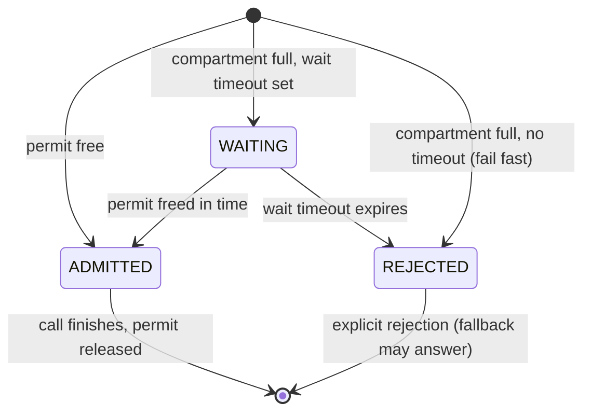

# Bulkhead

> Gives each dependency its own fixed slice of your service's capacity, so a slow database or a hanging API call can exhaust its slice — and nothing more.

!!! info "PRO feature"
    Bulkhead is a PRO-tier feature. It answers the production question behind most cascading
    outages: *"why did one slow dependency take the entire service down with it?"*

## What is it?

A ship's hull is divided into watertight compartments (bulkheads) so that a breach floods one
compartment and the ship stays afloat. The **bulkhead pattern** applies the same idea to your
application's capacity: instead of letting every request draw from one shared pool of workers and
connections, you partition that capacity into compartments, one per dependency or workload. When
the database slows down, the calls stuck waiting on it can only fill the *database* compartment;
the rest of the service keeps its capacity and keeps serving.

In Baldur, a bulkhead is a named **compartment** with a fixed number of **permits**: the
concurrent executions it will admit. A call enters its compartment before it runs; when the
compartment is full, the call is turned away immediately and explicitly instead of joining an
invisible pile-up.

## Why it matters

Most cascading failures share one root cause: a slow dependency plus unbounded concurrency. The
dependency doesn't even have to fail; it only has to get slow. Every in-flight call holds a
worker while it waits, new requests keep arriving, and within seconds every worker in the process
is parked on the same stuck dependency. Healthy endpoints stop answering, not because anything
they need is broken, but because there is nothing left to run them.

Bulkhead replaces that failure mode with a bounded, observable one:

- **An incident stays the size of one feature.** The slow dependency saturates its own
  compartment and nothing else. Checkout can degrade while browse, auth, and health checks keep
  their full capacity.
- **Fail fast and loud, not slow and silent.** A call that can't get a permit is rejected
  immediately with an error naming the compartment and its occupancy, instead of timing out
  minutes later somewhere deep in a queue, after the user has already given up.
- **Capacity becomes a deliberate budget.** You decide up front how much of your service the
  payment provider is *allowed* to occupy at its worst, instead of discovering the answer ("all
  of it") during an outage.
- **You see saturation before the outage.** Per-compartment occupancy, waiting, and rejection
  counts are live operational data — a compartment running hot is a warning you can act on while
  the service is still up.

## How it works in Baldur

Every protected call passes through a compartment chosen by **domain** — a name like `database`
or `external_api`. Four compartments are registered out of the box, each with a strategy matched
to its workload, and you can register your own compartment for any dependency you want to wall
off:

| Compartment | Isolation strategy | Default capacity |
|-------------|--------------------|------------------|
| `database` | semaphore | 10 concurrent |
| `cache` | semaphore | 20 concurrent |
| `external_api` | thread pool | 5 workers + 10 waiting |
| `message_queue` | semaphore | 15 concurrent |

Finer-grained compartments are supported per database alias (`database:replica`) and per cache
instance (`cache:session`), so a read replica can carry a different budget than the primary.

Three **isolation strategies** cover the three kinds of work:

- **Semaphore** (`SemaphoreBulkhead`) counts concurrent executions: the call runs on the
  caller's own thread, but only if a permit is free. The cheapest form, right for I/O-bound work
  like database queries and cache lookups.
- **Thread pool** (`ThreadPoolBulkhead`) runs the call inside a dedicated worker pool with a
  bounded waiting queue, fully separating it from the request workers; right for CPU-bound work.
  Request context and trace IDs follow the task into the pool, and each call carries an execution
  timeout (30 seconds unless you set one), so a runaway task cannot hold a worker forever.
- **Async semaphore** (`AsyncSemaphoreBulkhead`) is the same permit counting for asyncio
  applications, without ever blocking the event loop.

In the two semaphore strategies, admission is all-or-nothing. By default a call to a full
compartment **fails fast** — rejected on the spot rather than queued. Give the call a wait
timeout and it will wait up to that long for a permit before being rejected:

A thread-pool compartment admits through its waiting queue instead: while the queue has a free
seat, a call simply takes one — no wait timeout needed — and runs as soon as a worker frees up.
Only when the queue itself is full is the call rejected, on the spot regardless of any timeout.
The execution timeout keeps counting while the call sits in the queue, so a call that cannot
reach a worker in time is cut off with the timeout error, not a rejection.

Each state in that diagram is a live counter you can read per compartment: admitted calls are
`active_count`, waiting calls are `waiting_count`, and every rejection increments
`rejected_count`.

A rejection raises `BulkheadFullError`, which names the compartment and its occupancy (for
example `12/10 active`); the cause reads directly off the exception. A thread-pool call that
exceeds its execution timeout raises `BulkheadTimeoutError` instead, so "the compartment was
full" and "the task ran too long" are never conflated.

The **`@bulkhead` decorator** is the everyday entry point: name the compartment — one of the
built-ins, or a compartment you have registered — and it dispatches sync or async automatically.
`@bulkhead_for_database` and `@bulkhead_for_cache` pick the per-alias / per-instance compartment
for you. The four built-ins are always available; a custom compartment must be registered before
you decorate a call with it, and decorating one that was never registered fails fast with
`BulkheadNotFoundError` — the error lists every compartment that *is* registered, so a typo or a
skipped setup step is immediately obvious, and it behaves identically whether the call is sync or
async. An optional **fallback** answers *only* when the call was rejected because the compartment
was full — your own business exceptions propagate unchanged, and the not-registered error is
raised before any fallback is considered, so neither an application bug nor a setup mistake ever
silently turns into a fallback response.

Bulkhead also composes with the rest of Baldur's resilience policies. A compartment-full
rejection is classified as a *rejection* and a thread-pool overrun as a *timeout* — both distinct
from a genuine failure of your code — so retry, fallback, and circuit-breaker layers each react
to the right signal when stacked on the same call.

| What you observe | When it happens |
|------------------|-----------------|
| The call runs immediately | a permit is free in its compartment |
| The call waits, then runs | the compartment was full and the call had a wait timeout (semaphore), or every worker was busy and a queue seat was free (thread pool) |
| The call is rejected, naming the compartment and its occupancy | the compartment is full — on the spot, or once a semaphore call's wait timeout expires |
| Your fallback answers instead of an error | a fallback is configured and the rejection was compartment-full |
| A long task is cut off with a timeout error | a thread-pool call exceeds its execution timeout |
| The call fails immediately with a "compartment not found" error listing the registered compartments | the call names a custom compartment that was never registered — sync or async alike |
| The rejection counter and last-rejection time advance | every rejection, per compartment |
| A compartment is flagged as running hot | its utilization crosses 80% in the status summary |
| Thread-pool compartments stop accepting work, then drain | the service shuts down gracefully |

The live state of every compartment — type, capacity, active, waiting, total rejected, last
rejection time, utilization — is served by the admin server's read-only `/bulkheads` endpoint
and shown in the Web Console's **Bulkheads** panel; the status summary flags every compartment
above 80% utilization so the hot spots surface first. The same state is also exported as
Prometheus metrics: Baldur starts the metrics publisher automatically when the app boots — on
Django, Flask, FastAPI, or a plain-Python service alike — and refreshes the gauges on a fixed
interval. It is on by default; the on/off switch and the refresh interval are tunable settings.
On graceful shutdown, thread-pool compartments stop accepting new work when the drain begins,
and their in-flight tasks are waited on before the process exits.

## Configuration

A compartment's capacity is set **where the compartment is created, in code** — not through
environment variables. The four built-in compartments ship with the production-safe defaults in
the table above; a compartment you register yourself takes the capacity you give it (10
concurrent if you don't say). Each call site then just names its compartment and, optionally,
sets a wait timeout.

The tuning settings behind the built-in defaults are advanced / internal for v1.0: they are not
part of the public operator-tunable environment-variable allowlist yet.

Bulkhead ships with the PRO tier. The compartments and the status surface are available once PRO
is active; without it, the status endpoint reports the feature as unavailable.

## See also

- [Circuit Breaker](../oss/circuit-breaker.md) — stops calling a dependency that keeps failing; Bulkhead caps how much capacity it can consume while it degrades. Production setups run both.
- [Bulkhead API Reference](../../reference/pro/bulkhead.md) — full options and signatures
- [Admin REST API](../../reference/api-admin.md) — the read-only status surface
- [Getting Started](../../getting-started/index.md) — set Baldur up
- [Environment Variables](../../reference/env-vars.md) — the complete operator-tunable list
