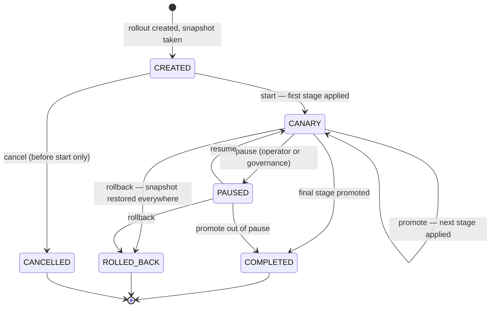

# Canary Recovery

> Rolls a configuration change out to a small slice of your fleet first, watches it, and restores
> the previous configuration automatically if the rollout degrades or stalls — so a bad config
> change becomes a contained incident instead of a fleet-wide one.

!!! info "PRO feature"
    Canary Recovery is a PRO-tier feature. It answers the production question every config change
    raises: *"what if this setting is wrong — and how fast can we get back?"*

## What is it?

Coal miners once carried a canary into the mine: the bird reacted to bad air before the miners
did, so trouble was discovered while it was still survivable. A **canary rollout** applies the
same idea to configuration changes: instead of switching the whole fleet to a new value at once,
you apply it to a small group first, watch how that group behaves, and only then widen the
change step by step.

In Baldur, a canary **rollout** is a first-class object: one configuration change (say, lowering
a circuit breaker's failure threshold) plus an ordered list of **stages**, each naming the
clusters it applies to and how long to observe them before advancing. The *recovery* half of the
name is the other direction: at creation time Baldur snapshots the configuration being replaced,
and rolling back (manually, or automatically when the rollout goes wrong) restores that
snapshot on every cluster the rollout touched. It is a configuration write, not a redeploy, so
recovery takes effect without restarting anything.

## Why it matters

Configuration changes are the classic "small change, large blast radius" hazard: they skip the
code-review-and-CI pipeline that protects code changes, they take effect immediately, and a bad
value (a timeout too low, a threshold too aggressive) often *looks* fine until production traffic
hits it. Canary Recovery turns that one-shot gamble into a supervised, reversible process:

- **A bad value hurts one stage, not the fleet.** The first stage is your blast-radius cap: if
  the new value misbehaves, only the canary clusters feel it while the rest of the fleet keeps
  the old configuration.
- **The way back is prepared before the way forward.** The previous values are captured when the
  rollout is created; recovery never depends on someone remembering what the old setting was at
  3 a.m.
- **Forgotten rollouts clean themselves up.** A rollout that stalls (promotion blocked, an
  operator pulled away mid-change) is detected, announced, and eventually rolled back
  automatically. "Half the fleet on config A, half on config B, nobody remembers why" stops
  being a failure mode.
- **An escalating incident pulls the brake for you.** If Baldur's Emergency Mode climbs while
  rollouts are mid-flight, they are paused automatically — and at the highest severity, rolled
  back — without waiting for an operator to remember the canary among everything else on fire.
- **One emergency lever for the worst day.** A single panic action rolls back *every* active
  rollout at once, when the situation is too murky to triage them one by one.
- **Every step is attributable.** Creation, every promotion, every pause and rollback is recorded
  with who did it and why — including (especially) the cases where someone bypassed a safety
  gate.

## How it works in Baldur

A rollout is created with a **config type** (which configuration this changes), the **new
values**, and its **stages**. Each stage names its clusters, the share of the fleet it
represents, how many minutes to observe it (5 by default), whether it may **auto-promote** when
that time passes, and the **pass criteria** the stage must meet to be considered healthy. At
creation Baldur also records the configuration's current values — the snapshot that rollback
will restore.

Only one rollout can be active per config type: the rollout holds a lock on its config type
until it reaches a terminal state, and creating a second rollout for the same config type is
rejected, naming the rollout that holds the lock. The lock is kept alive for as long as the
rollout is supervised, and it is self-clearing — an abandoned rollout lets its lock lapse, and
the auto-rollback backstop (below) releases the lock of any started rollout that gets stuck, so
no failure mode leaves a config type frozen forever.

The rollout then moves through an explicit lifecycle:

Every transition is validated against this state machine — a completed or rolled-back rollout
cannot be restarted, and cancel works only before the first stage is applied. State changes are
saved with optimistic versioning: when two actors race (two operators, or an operator and the
automatic watchdog), one wins and the other's action fails cleanly with a version conflict
instead of corrupting the rollout.

### The gates in front of every step

Starting, promoting, and resuming a rollout each pass a **governance gate** first, and the gate
is *fail-closed*: if the governance check itself cannot run, the operation is blocked rather
than waved through. For start and promote the gate refuses while the global kill switch is
engaged, while Emergency Mode is at or above its configured severity (level 2 of 3 by default),
or — when the error-budget gate is turned on (`BALDUR_ERROR_BUDGET_GATE_ENABLED=true`, off by
default in v1.0) — while the error budget is exhausted (judged more strictly for higher-tier
services). Pushing a config change deeper into a fleet that is already in trouble is exactly the
wrong move. Resume and rollback are deliberately gated more
lightly: both re-check only Emergency Mode, skipping the kill-switch and error-budget checks —
rollback is the recovery path, and the way back must stay open on a bad day.

Each gate can be explicitly bypassed for emergencies — but a bypass demands a written reason (at
least 10 characters) and the requester's identity, and it is recorded in the audit trail flagged
for post-incident review. There is no quiet override.

A **chaos guard** protects the rollout's measurements: applying a config change to a cluster
that is currently running a chaos experiment would make the canary's metrics unreadable (was
that latency spike the new config, or the injected fault?). By default the guard simply excludes
the affected clusters and proceeds with the rest; if *every* target cluster is under chaos, the
rollout is blocked. A strict policy that blocks on any overlap, and an explicit force flag for
emergencies, are both available.

### Health validation and promotion

Each stage carries **pass criteria** — the thresholds the canary must stay inside to be
considered healthy. The defaults: error rate at most 5% absolute and at most 1 percentage point
above the baseline, p95 latency within +50 ms, and p99 within +20%, measured over a 5-minute
window with at least 100 requests — too little traffic means "not enough evidence", not "pass",
so a quiet canary blocks promotion instead of waving the change through.

The criteria can also watch the **error budget**, but that check ships OFF by default in v1.0
(`BALDUR_ERROR_BUDGET_ENABLED`): out of the box it honestly skips — and logs that it did —
rather than reading empty data as a healthy pass. Turned on, it blocks promotion while the
canary is burning error budget faster than 1.2× its sustainable rate or has less than 10% of the
budget left. It is deliberately fail-open — an unavailable budget signal skips the check rather
than freezing the rollout — and only an explicitly forced, audited promotion bypasses it; the
governance gate above still enforces its own (separately enabled) budget stop.

Criteria tighten by **service tier**, and the tier is resolved automatically: each config type
maps to a service tier through configuration, an unmapped config type defaults to `standard`,
and an explicit tier on the promote call overrides both. The tier's floors then clamp the
stage's criteria — a 3% error-rate ceiling for a `critical` service versus 5% for `standard`
and 10% for `non_essential`, and a `critical` canary may drain budget no faster than 0.8×
sustainable, keeping at least 15% in reserve. The floor always wins over a looser per-stage
value: you can make a stage stricter than its tier, never more lenient — and when a floor
actually tightens a stage, the clamped fields are logged so the stricter verdict is explainable.

Metric-gated promotion compares the canary clusters against the stable fleet over the evaluation
window and blocks promotion when the criteria fail. It is an opt-in gate: it comes online once a
time-series metrics source is connected to Baldur and live evaluation is switched on; until then,
promotion is governed by stage duration, the governance gate, and — when Error Budget is enabled —
the error-budget drain check above (the per-rollout metrics view fills in from the same source). A blocked or unhealthy rollout does not advance — which hands it to the
watchdog below.

### The watchdog: automatic promotion, automatic recovery

Canary Recovery ships three background jobs with a ready-made schedule (for Celery deployments):
a promotion check every minute, a stalled-rollout scan every 5 minutes, and metrics collection
every 2 minutes.

The **promotion check** advances stages marked auto-promote once their observation time has
passed — through the same governance gate and metric validation as a manual promote, never
around them. With auto-promote on every stage (the default), a healthy rollout walks itself to
completion with no operator involvement.

The **stalled-rollout scan** is the recovery backstop. A rollout is flagged as stalled when it
sits in the canary state for more than twice its stage's observation time, or paused for more
than 30 minutes — unless it was paused *by* governance or the error budget, which is a
legitimate wait, not a stall. A stalled rollout triggers a high-priority notification naming the
rollout, its config type, how long it has been stuck, and who created it. If it stays stuck past
the auto-rollback deadline (60 minutes by default), the watchdog rolls it back automatically:
the snapshot is restored on every affected cluster, the action is audited under the watchdog's
own identity, and a second notification reports what was rolled back and where. Degradation and
abandonment thus converge on the same safe end state: blocked promotion stalls the rollout, and
a stalled rollout becomes a rollback.

The same 5-minute scan also keeps each active rollout's config-type lock renewed, which is what
lets a long-running or long-paused rollout hold its lock past the lock timeout — so a second
rollout for that config type stays rejected while the first is alive.

### The emergency brake

The governance gate stops *new* operations during an emergency — but a rollout already in
flight has its new configuration applied to live clusters, and it should not keep sitting
there while the fleet burns. A background safety watch re-reads the Emergency Mode level
continuously — reacting within seconds of a level change in the common case, and never later
than its polling interval (30 seconds by default) — and applies an escalation ladder to every
in-flight rollout:

- **Level 1:** a warning is logged; rollouts keep running.
- **Level 2:** every in-flight rollout is **paused** automatically, recorded as paused by the
  safety interlock (not an operator) with the emergency as the reason.
- **Level 3:** every in-flight rollout is **rolled back** immediately: the snapshot is
  restored, and the action is audited under the system's own identity, flagged as a governance
  bypass with its reason, the same no-quiet-override rule that applies to humans.

A rollout paused by the brake does not resume on its own when the emergency clears — resuming
stays an explicit action, re-checked against Emergency Mode. And the zombie watchdog keeps
counting: an emergency pause that lingers past 30 minutes notifies, and past 60 minutes rolls
back, so a prolonged emergency converges on the same safe end state as every other stall.

If the emergency state itself cannot be read, new starts and promotions are already blocked —
the gate is fail-closed — and for in-flight rollouts the watch raises a critical alert after
three consecutive failed reads (configurable) and keeps trying. Deployments that prefer the
pessimistic posture can instead configure sustained blindness to be treated as the worst case
and roll back.

### The emergency lever

`POST /canary/panic-rollback` rolls back **all** active rollouts in one call, reporting
per-rollout success so a partial failure is visible immediately. It exists for the day when
something is clearly wrong fleet-wide and detangling which of three in-flight rollouts caused it
is a luxury you don't have.

### What you see

| What you observe | When it happens |
|------------------|-----------------|
| Creating a second rollout for a config type is rejected, naming the current holder | one active rollout per config type, enforced by lock |
| Start or promote is refused with a governance message | kill switch engaged, Emergency Mode at level 2+, or the error budget exhausted (only with the error-budget gate enabled) — or the check itself failed (fail-closed) |
| Some clusters are silently skipped at start | a chaos experiment is running there; the guard excluded them |
| The rollout advances on its own | the stage's observation time passed, auto-promote is on, and the gates passed |
| A high-priority "zombie rollout" notification | the rollout stalled past its threshold |
| A promotion is validated against stricter limits than the stage declared, with the tightened fields logged | the service's tier floor — resolved automatically from its config type — clamped the stage's criteria |
| Every in-flight rollout pauses at once, marked paused by the safety interlock | Emergency Mode escalated to level 2 |
| Every in-flight rollout rolls back, audited under the system's own identity as a flagged bypass | Emergency Mode escalated to level 3 |
| The previous configuration reappears on every affected cluster | manual rollback, panic rollback, or the watchdog's auto-rollback after 60 minutes stuck |
| An action fails with a version conflict | a concurrent actor changed the rollout first — no state corruption |
| A bypass appears in the audit trail with reason and requester | someone bypassed a governance gate; a forced start during chaos is likewise recorded, with the clusters involved |
| Completed and rolled-back rollouts appear in the daily report | both finishing outcomes — completion and rollback — are pushed to the ops summary |

The full rollout state — stage list, current stage, progress percentage, affected clusters,
the canary's error rates and latency before vs. after — is served by the admin server: list and
detail views, per-rollout metrics, and history are readable with the viewer role, while every
mutating action (create, start, promote, rollback, pause, resume, cancel, panic) requires the
admin role. The Web Console shows the same picture in its **Canary Rollouts** panel. Lifecycle
transitions are published on Baldur's event bus, automatic promotions blocked by governance are
counted in Prometheus alongside a gauge of rollouts waiting to advance, and every lifecycle
action lands in the audit trail with actor and reason. Finished rollouts are retained for 7 days for review.

## Configuration

| Env Var | Default | What it controls |
|---------|---------|------------------|
| `BALDUR_LICENSE_KEY` |  | PRO entitlement (unset in OSS mode) — Canary Recovery activates when Baldur initializes with a valid license |
| `BALDUR_REDIS_URL` | `redis://localhost:6379/0` | where rollout state, the per-config-type lock, and the active-rollout set are stored |

Everything that shapes an individual rollout — stages, clusters, observation times,
auto-promote, pass criteria — is part of the rollout you create, in the API call, not an
environment variable. The framework-level tuning behind the defaults (watchdog thresholds, the
emergency brake's polling interval and failure posture, the config-type→service-tier mapping,
governance severity levels, retention) is advanced / internal for v1.0: it is not part of the
public operator-tunable environment-variable allowlist yet.

## See also

- [Emergency Mode](emergency-mode.md) — the severity levels the governance gate honors before letting a rollout advance
- [Audit Trail](audit.md) — where every rollout action, and every gate bypass, is recorded
- [Canary API Reference](../../reference/pro/canary.md) — full options and signatures
- [Admin REST API](../../reference/api-admin.md) — the rollout control surface
- [Getting Started](../../getting-started/index.md) — set Baldur up
- [Environment Variables](../../reference/env-vars.md) — the complete operator-tunable list
