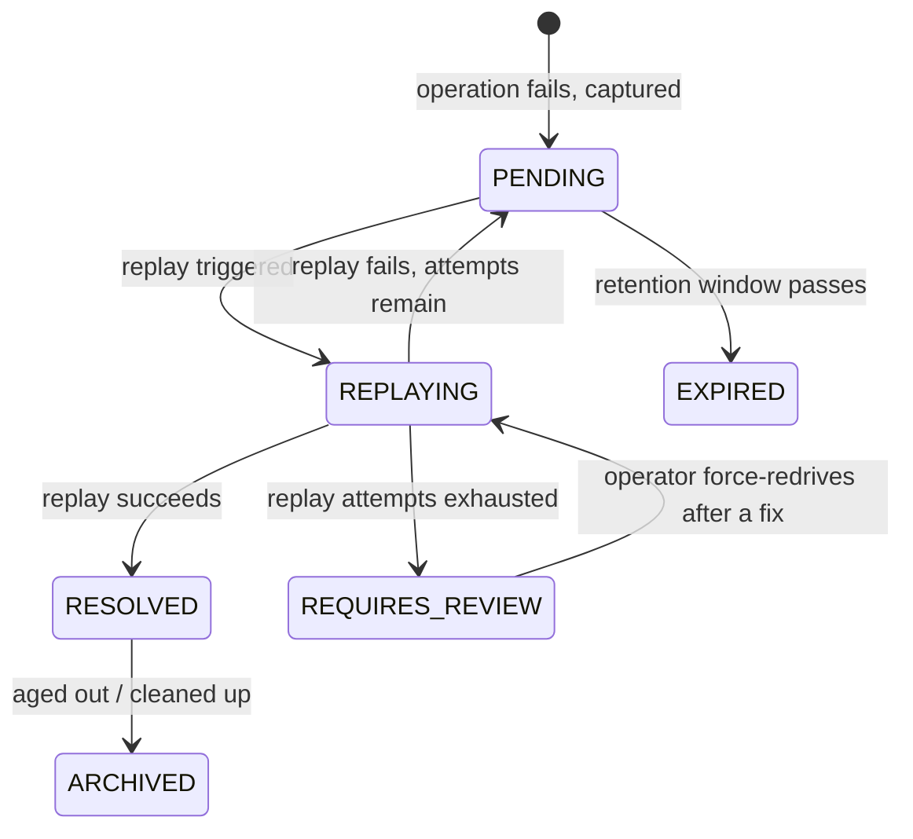

# DLQ + Replay

> Catches every operation that fails because a dependency was down — with the context needed to run it again — so nothing is silently lost, and you can replay the backlog once the dependency recovers.

!!! info "PRO feature"
    DLQ + Replay is a PRO-tier feature. It answers the production question every team eventually
    hits: *"what happened to the work that failed while our database / payment provider / webhook
    target was down?"* Without it, that work is simply gone. With it, the work is preserved and
    replayable.

## What is it?

When an operation in your app fails because something it relies on is unavailable (a database
timeout, a payment provider returning 503, a webhook endpoint that won't answer), that unit of work
usually just disappears. The request errors out, maybe a line lands in a log file, and the actual
work (the payment, the job, the message) is lost.

A **dead letter queue** (DLQ) is the standard name for a holding area where failed work is parked
instead of thrown away. Think of the "undeliverable mail" bin at a post office: a letter that
couldn't be delivered isn't shredded; it's set aside so it can be looked at and sent again later.
**Replay** is the act of taking that parked work and running it again. In Baldur these two halves
are a single feature: **DLQ + Replay**.

## Why it matters

Without a dead letter queue, an outage doesn't only cause errors *while* it is happening — it causes
**permanent data loss**. Every payment, job, or message that failed during the outage is gone, and
recovering it means digging through logs and reconstructing the work by hand, if it can be recovered
at all.

DLQ + Replay turns that permanent loss into a recoverable backlog:

- **No silent loss.** Every failed operation is captured together with the forensic context (what
  was being done, the request data, the failure reason, the stack trace) needed to understand and
  re-run it.
- **Recover on your schedule.** When the dependency comes back, replay the backlog instead of
  rebuilding lost work from log files.
- **Catch-up can be automatic, and self-paced.** Baldur can replay queued work the moment a tripped
  circuit breaker for that dependency recovers, so the backlog drains itself without an operator
  watching the clock. The catch-up can adapt to how the recovery is going, shrinking each replay
  batch while replays are still failing and growing it once they succeed, so draining a backlog never
  re-hammers a dependency that has only just come back up.
- **Even repeat failures aren't a dead end.** A failure that keeps failing isn't replayed forever or
  silently dropped. Once it exhausts its replay budget it is parked for review instead of looping.
  After you fix the underlying cause you can deliberately re-drive it, so even a "poison-pill" failure
  is recoverable rather than lost.
- **The queue protects itself.** Size limits (overall and per-domain) plus an overflow strategy
  keep a failure storm from filling your storage and dragging the rest of the system down with it.

## How it works in Baldur

When an operation Baldur is protecting fails, it is captured as an **entry** in the dead letter
queue, recording the context needed to replay it later. Capturing a failure is designed to stay off
the request's critical path, so recording a failure doesn't add latency to the call that already
failed. Each entry then moves through a lifecycle you can watch in the Web Console DLQ panel or query
over the REST API:

You have three ways to replay the queued work:

- **Targeted replay.** Pick a single entry (or one domain) and replay it from the Web Console or the
  REST API. Useful when you want to confirm a fix before draining everything.
- **Batch replay by type.** Replay everything of a given domain or failure type at once, for
  example every database-timeout failure after the database recovers.
- **Automatic on recovery.** When a dependency's circuit breaker closes again after an outage, Baldur
  can sweep that dependency's queued failures and replay them, so recovery and catch-up happen
  together. You can enable **adaptive batch sizing** for these automatic sweeps: instead of a fixed
  batch size, Baldur watches the success rate of each batch and adjusts the next one, shrinking the
  batch when too many replays are still failing and growing it again after several clean batches,
  staying between a floor and a ceiling you set. The backlog drains quickly while the dependency is
  healthy and backs off automatically if it starts struggling again.

When a failure can't be replayed successfully (the dependency is still down, or the work itself is
broken), Baldur retries it up to a configurable budget. An entry that exhausts that budget is neither
retried forever nor discarded: it converges to a terminal **needs-review** state, where it stays
queryable so an operator can investigate. Once the root cause is fixed, an operator can deliberately
**force-redrive** the parked entry, an audited, admin-level action that grants it a fresh replay
budget and sends it back through replay. If the underlying problem still isn't fixed, the entry simply
returns to the needs-review state, so a force-redrive can never turn a poison-pill into an endless loop.

| What you observe | When it happens |
|------------------|-----------------|
| A failed operation appears in the queue with its failure reason and request data | a protected operation fails |
| You replay one entry, a whole domain, or a failure type | a targeted or batch replay from the Web Console or REST API |
| Queued work drains on its own | a dependency's circuit breaker recovers and an automatic replay sweep runs |
| The automatic sweep speeds up or eases off batch by batch | adaptive batch sizing is enabled and the recent replay success rate changes |
| An entry stops being retried and is parked in a needs-review state | its replay attempts are exhausted |
| You re-drive a parked entry after fixing its root cause | a deliberate, admin-level force-redrive from the Web Console or REST API |
| Old entries age out — expiring, then archiving | the retention window passes |
| New failures are dropped, rejected, or summarized instead of growing the queue without bound | the queue hits its size limit and the overflow strategy applies |

When the queue reaches its size limit, the **overflow strategy** decides what gives:

- `drop_oldest`: evict the oldest entries to make room for new failures (the default).
- `reject`: refuse new entries (surfaced as a 503) so nothing already queued is displaced.
- `compress_oldest`: summarize the oldest entries into a compact record before evicting them, so an
  aggregate trace of what failed survives even after the raw entries are gone. These summaries are
  grouped by failure type and stay queryable over the REST API, and they age through their own
  lifecycle — `ACTIVE`, then `STALE`, then `ARCHIVED` — so old aggregates clean themselves up over
  time instead of accumulating forever.

By default the queue lives in your configured storage backend; for deployments that cannot tolerate
losing even queued-but-not-yet-replayed work across a process crash, a durable storage mode keeps the
queue crash-safe without slowing down the failure path that feeds it.

Because capture runs off the request's critical path, the outbox that buffers failures is itself
monitored so it can never silently lose work. It exposes leading-indicator signals (how deep the
buffer is and how long entries wait before being written) and raises an alert if its drop rate
crosses a threshold, while its background drain worker's liveness is watched separately. You see the
buffer filling up *before* it starts shedding, rather than discovering after the fact that captured
failures were dropped.

## Configuration

The knobs an operator sets most often. The full list lives in the API reference.

| Env Var | Default | What it controls |
|---------|---------|------------------|
| `BALDUR_DLQ_ENABLED` | `true` | Whether failed operations are captured into the dead letter queue at all |
| `BALDUR_DLQ_MAX_SIZE` | `100000` | Maximum total entries the queue holds before the overflow strategy applies |
| `BALDUR_DLQ_OUTBOX_ENABLED` | `true` | Capture failures through a non-blocking outbox so recording a failure stays off the request hot path |
| `BALDUR_REDIS_URL` | `redis://localhost:6379/0` | The Redis backend the queue is stored in (shared by Baldur's Redis consumers) |
| `BALDUR_EVENT_LOGGING_DLQ_LOG_LEVEL` | `INFO` | Log level for DLQ capture and replay events |

## See also

- [Getting Started](../../getting-started/index.md) — set it up
- [DLQ API Reference](../../reference/pro/dlq.md) — full options and signatures
- [Replay API Reference](../../reference/pro/replay.md) — replay service options
- [Environment Variables](../../reference/env-vars.md) — the complete operator-tunable list
