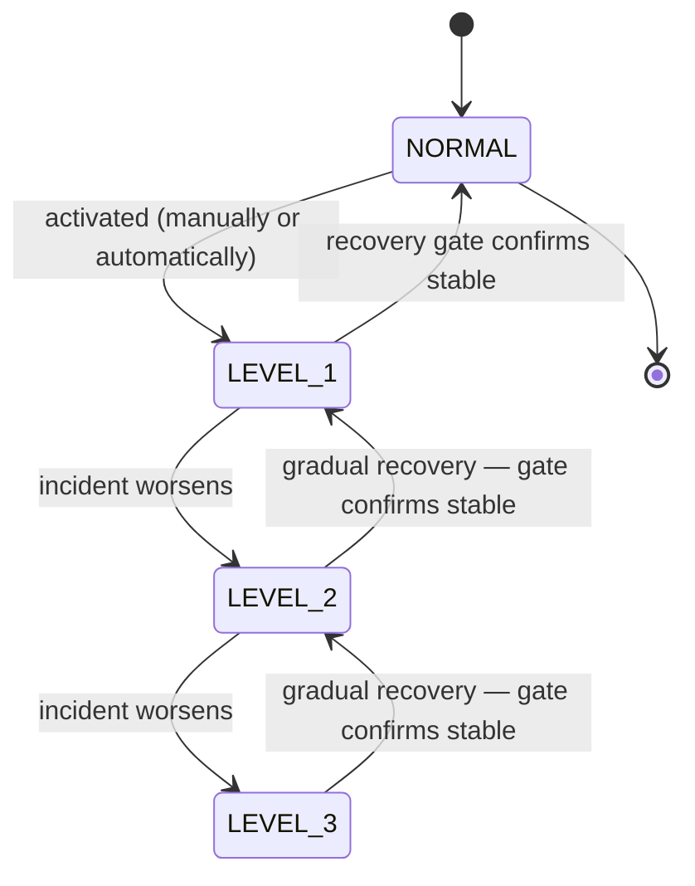

# Emergency Mode

> When your system is under stress, Emergency Mode sheds non-critical traffic in deliberate steps to protect your core operations — and refuses to stand down until the system has actually stabilized.

!!! info "PRO feature"
    Emergency Mode is a PRO-tier feature. It answers the production question that follows every major incident: *"how do I keep the critical path alive when everything is overloaded — and how do I avoid making it worse by recovering too soon?"*

## What is it?

When a service comes under severe stress (a traffic spike, a failing dependency, an overloaded database), the instinct is to keep serving everything and hope it holds. Usually it doesn't: the system tries to do all of its work at once, runs out of headroom, and *everything* degrades, including the requests that matter most.

**Graceful degradation** is the discipline of giving up the right things first. Instead of failing all at once, the system deliberately drops its least important work so the most important work keeps running — like hospital triage that postpones routine check-ups to keep the emergency room open. **Emergency Mode** is Baldur's name for a managed, stepwise version of this: it sorts your traffic into tiers and progressively sheds the lower tiers as the situation worsens, then eases back only when it is safe to do so.

## Why it matters

Without a managed degradation path, an overload is all-or-nothing: either you serve everything (and the critical path drowns along with the rest) or you take the whole service down. Both are bad outcomes during an incident, exactly when you can least afford them.

Emergency Mode replaces that with a deliberate, observable response:

- **Protect the critical path under load.** Non-essential and lower-priority traffic is shed first, preserving capacity for the requests that actually matter (payments, auth, core reads) instead of letting them compete with everything else.
- **Respond in proportion to severity.** Four levels mean a minor incident sheds only the non-essential tier, while a severe one clamps down hard. You are not forced to choose between "do nothing" and "pull the plug."
- **Recover safely, not optimistically.** The most dangerous moment in an incident is the recovery: lift the restrictions too early, the still-fragile system gets slammed again, and you are back where you started, often worse. Emergency Mode gates recovery behind a live stability check and steps back down gradually, so you don't trade one outage for two.
- **Every change is attributable.** Each activation, escalation, and recovery records who (or what) triggered it, why, and when (visible in the status and history views) so the incident timeline is reconstructable afterward.
- **Hands-off or hands-on.** It can fire automatically when Baldur detects a serious incident, or be driven manually by an operator from the admin console or REST API. Either way the same levels and the same recovery gate apply.

## How it works in Baldur

Emergency Mode moves your service through four levels. NORMAL is business-as-usual; each higher level sheds more load by giving every request an **admission allowance** based on its traffic class — **critical**, **standard**, or **non-essential**. An allowance of *full* admits the whole class; a fractional allowance admits that share and turns the rest away (the shed requests are rejected, not queued); *blocked* refuses the class outright. This is classic load shedding, applied per tier so the shedding always falls on the least important work first.

| Level | Non-essential | Standard | Critical | Meaning |
|-------|---------------|----------|----------|---------|
| **NORMAL** | full | full | full | Normal operation — all traffic allowed |
| **LEVEL_1** | blocked | full | full | Minor incident — non-essential work is dropped |
| **LEVEL_2** | blocked | 10% | full | Moderate incident — standard traffic throttled, critical path intact |
| **LEVEL_3** | blocked | blocked | 50% | Severe incident — only the critical path runs, and even it is throttled |

These are the default allowances; an operator can override the per-level policy.

Levels escalate as an incident worsens and step back down through a **recovery gate** as it clears:

An operator can also activate directly at any level — you don't have to climb through them — and, when necessary, force a release straight through the gate.

**Activation** happens one of two ways:

- **Automatic.** When Baldur detects a serious enough problem, it activates emergency mode itself, picking a level that matches the severity and attaching a default expiry so a transient blip self-clears without anyone watching the clock. An automatic activation never *lowers* an already-higher level — it only escalates.
- **Manual.** An operator activates a chosen level from the admin console or REST API, giving a reason and optionally an auto-expiry duration; without a duration it stays active until released.

**Recovery is gated** — this is the mechanism behind the "recover safely" guarantee. Standing down from emergency mode is not automatic just because someone asked for it. Before any level drops, the recovery gate **reads the service's live health metrics — error rate and CPU/load — and compares them against safe thresholds**. It refuses the exit while either metric is still above its threshold, and if it cannot read the metrics at all it **fails closed**: it treats the system as not-yet-recovered and keeps emergency mode on, rather than guessing that things are fine. Once the gate is satisfied, recovery proceeds **gradually** — the level steps down one notch at a time, and before each step the gate waits out a stabilization window and re-checks the metrics. If a mid-recovery re-check fails, the descent **stops and holds the current level** rather than continuing down or snapping straight to NORMAL, so a system that destabilizes halfway through recovery keeps its remaining protection instead of shedding it at the worst moment. An operator who must exit regardless can **force** the release, deliberately bypassing the gate.

| What you observe | When it happens |
|------------------|-----------------|
| Non-essential, then standard, then part of critical traffic is shed | the level rises from NORMAL toward LEVEL_3 |
| Emergency mode turns on by itself, at a severity-matched level, with an expiry | Baldur auto-detects a serious incident |
| You activate or release a level, with the reason recorded | a manual trigger or release from the admin console or REST API |
| A release is refused until the metrics are back within bounds | the recovery gate blocks a premature exit (force to override) |
| Restrictions ease one level at a time, and pause if the system wobbles | a gradual recovery runs after the gate confirms stability |
| The full activation and recovery timeline — who, what, when, why | you read the status and history views |

Emergency Mode also respects Baldur's global [System Control](../oss/system-control.md) kill switch: an automatic activation stands down while the kill switch is engaged, and a manual activation must be explicitly overridden — an audited action.

## Configuration

Emergency Mode is operated through the **admin REST API / Web Console**, not through environment variables — there is no enable flag to set. An ADMIN-level operator triggers a level, releases it, starts or stops a gradual recovery, and adjusts the recovery-gate thresholds **at runtime** through the admin endpoints; VIEWER-level access can read the current state, the level definitions, and the change history.

Its internal tuning thresholds — the recovery stabilization window, the CPU and error-rate limits the gate enforces, the level-decision thresholds — ship with production-safe defaults and are **advanced / internal for v1.0**: they are not part of the public operator-tunable environment-variable allowlist yet. Of these, only the recovery-gate thresholds — the stabilization window and the CPU and error-rate limits — are adjustable at runtime through the admin config endpoint; the thresholds that decide which level an automatic activation selects remain internal defaults for v1.0.

Emergency Mode ships with the PRO tier; the admin endpoints are available once PRO is active, and report the feature as unavailable otherwise.

## See also

- [System Control](../oss/system-control.md) — the global kill switch Emergency Mode honors
- [Admin REST API](../../reference/api-admin.md) — the admin surface that drives Emergency Mode
- [Emergency Mode API Reference](../../reference/pro/emergency-mode.md) — full options and signatures
- [Getting Started](../../getting-started/index.md) — set Baldur up
- [Environment Variables](../../reference/env-vars.md) — the complete operator-tunable list
