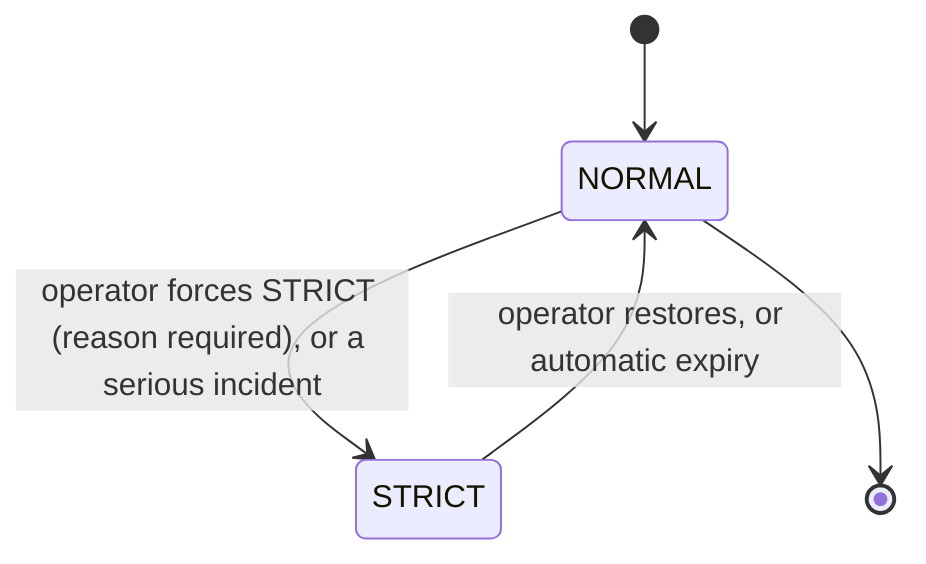

# Governance

> A safety gate that every automated recovery action must pass before it runs — so Baldur never acts at the worst possible moment, and you can always prove afterward why it did or didn't.

!!! info "PRO feature"
    Governance is a PRO-tier feature. It answers the question that keeps people from trusting automation in production: *"if I let Baldur take recovery actions on its own, how do I stop it during an incident — and how do I show an auditor exactly why each action was allowed or blocked?"*

## What is it?

Self-healing automation is powerful precisely because it acts without waiting for a human. That is also what makes it dangerous: the moment you most want automation to *stop* (a major incident, a botched deploy, an exhausted error budget) is exactly when un-governed automation keeps firing, sometimes making the situation worse.

**Governance** is Baldur's answer to that. It is a *pre-flight checklist* that runs before any automated action: a small, fixed set of safety questions ("is the system globally enabled? are we in a declared emergency? is the error budget healthy?") that must all pass before the action is allowed. If any answer says "not now," the action is blocked and the reason is recorded. Think of it as the brake pedal and the flight recorder for your automation, in one layer.

## Why it matters

Without a governance layer, automated recovery is all-or-nothing: either it is running (and you have no single place to halt it) or you have disabled it entirely (and lost the protection). Neither is acceptable in production, and neither survives a compliance review, which wants to see *who could stop automation, how, and what the record shows.*

Governance replaces that with a deliberate, observable control surface:

- **One brake for all automation.** A global kill switch and a declared emergency state stop self-healing actions across the whole system at once; you are never hunting for individual toggles during an incident.
- **Safety guards that match the moment.** Automation is held back when the system is already in an emergency, or when the error budget is critically low and the right move is to force a human into the loop — not to let robots keep retrying.
- **An answer to "why didn't this run?"** Every block is written to the audit trail with its reason, so the incident timeline is reconstructable: *"the replay was blocked because the system was in a LEVEL_2 emergency at 14:03."*
- **A controlled escape hatch.** When an operator genuinely must override the guards, a **Break Glass** bypass lets everything through, but the bypass itself is recorded and flagged for a mandatory post-incident review, so the exception is never silent.
- **Dual control for sensitive changes.** Risky governance changes can require a second admin to approve (a four-eyes check), so no single account can quietly flip the safety settings.

## How it works in Baldur

### The pre-action gate

Before a self-healing action runs, governance evaluates a **fixed sequence of safety checks** and stops at the **first one that fails**. The check that fails determines the block reason the caller sees:

| Order | Check | Blocks when | Reason reported |
|-------|-------|-------------|-----------------|
| 0 | **Break Glass** | engaged | *bypass* — all checks below are skipped |
| 1 | **Kill switch** | Baldur is globally disabled via [System Control](../oss/system-control.md) | `kill_switch` |
| 2 | **Emergency level** | the system is in an emergency at or above the configured minimum level | `emergency_mode` |
| 3 | **Error budget** | the error budget has dropped below its threshold | `error_budget` |

If every check passes, the action proceeds. If one fails, the caller receives a structured result — `allowed = false`, the machine-readable reason above, and a human-readable message (e.g. *"Emergency mode LEVEL_2 is active. Auto-restore in ~3.4h."*) — and the block is written to the audit trail.

A developer applies the gate without writing the checks by hand. The simplest form is a decorator on the automation method:

```python
@require_governance(check_error_budget=True)
def replay_dead_letters(self):
    ...  # runs only if every governance check passes
```

Narrower decorators — `require_system_enabled`, `require_not_emergency`, `require_error_budget` — each guard a single dimension, and a service class can inherit `GovernanceCheckMixin` to call `check_governance()` or `is_automation_allowed()` inline when it needs the result rather than an all-or-nothing wrapper.

### Fail-open by design

Governance is a guard, and a guard must never become the outage. If a check **cannot be evaluated** (its backing subsystem is unreachable or errors out), governance **fails open**: it allows the action rather than blocking it, and raises a **FAILSAFE alert** (rate-limited so it cannot storm) telling operators that automation is running *without* that guard. The safety stance is explicit: a broken governance check degrades to "unprotected but running," never to "everything blocked."

So that the gate stays cheap on a hot path, each check reads live system state through a short-lived cache; a relevant state change — the emergency level moving, the kill switch flipping — invalidates that cache immediately, so the gate reflects the new state on the very next call rather than waiting for the cache to age out.

### Operating mode and automatic expiry

Governance tracks a system-wide **operating mode**. **NORMAL** is business as usual; **STRICT** is a declared heightened-caution state that an operator can force (a reason is mandatory) and that a serious incident can trigger. Every STRICT activation records *who* set it, *why*, and *when*.

STRICT is deliberately **self-expiring**: a forgotten emergency state is its own hazard, so it does not stay on forever:



While STRICT is active, governance walks an escalating notification timeline and finally stands the system down on its own (default timings shown; an operator can adjust them):

| Elapsed | What happens |
|---------|--------------|
| 4 hours | A **warning** notification is sent — the emergency has run long enough to need review |
| 6 hours | A **final warning** is sent — automatic restore is approaching |
| 8 hours | The system **auto-restores to NORMAL** and notifies, so a transient emergency cannot linger indefinitely |

### Dual control and the status view

Sensitive governance changes can be routed through an **approval workflow**: a request is filed, and a **different** admin must approve it — the system rejects an attempt to approve your own request (the four-eyes principle). Approval thresholds distinguish operator-level from admin-level actions.

At any time an operator can read a governance **status view**: the current operating mode, whether an emergency is active and why, the expiry countdown, the warning state, and the configured thresholds — the single place to answer "what is governance doing right now?"

| What you observe | When it happens |
|------------------|-----------------|
| An automated action is blocked with a reason (`kill_switch`, `emergency_mode`, or `error_budget`) | the first failing check stops it before it runs |
| A FAILSAFE alert warns that automation is running without a guard | a governance check could not be evaluated and failed open |
| An audit entry recording why an action was or wasn't allowed | any block (and any Break Glass bypass) is written to the trail |
| Warning, then final warning, then an automatic return to NORMAL | the system stays in STRICT past 4h / 6h / 8h |
| An approval request that a second admin must clear | a sensitive change is filed for dual control |

## Configuration

Governance is operated at **runtime through the admin REST API / Web Console**, not through environment variables — there is no enable flag to set in the environment. Through the admin endpoints an ADMIN-level operator forces the operating mode, files and approves change requests, and adjusts the governance settings: the emergency expiry and warning timings, the operator/admin approval thresholds, and the notification channels. VIEWER-level access can read the governance status, mode, and history.

The gate's **safety semantics are fixed** and not operator-tunable: checks always run in the order above, the gate always stops at the first failure, every block is always audited, and an un-evaluable check always fails open. The **Break Glass** bypass is itself a runtime emergency control — engaging it is an audited action that requires a post-incident review.

These controls are **advanced / internal for v1.0**: governance has no entries in the public operator-tunable environment-variable allowlist yet. Governance ships with the PRO tier; the admin endpoints are available once PRO is active, and report the feature as unavailable otherwise.

## See also

- [Emergency Mode](emergency-mode.md) — the stepwise load-shedding that the emergency-level check consults
- [System Control](../oss/system-control.md) — the global kill switch the gate honors
- [Admin REST API](../../reference/api-admin.md) — the admin surface that drives governance
- [Getting Started](../../getting-started/index.md) — set Baldur up
- [Environment Variables](../../reference/env-vars.md) — the complete operator-tunable list
