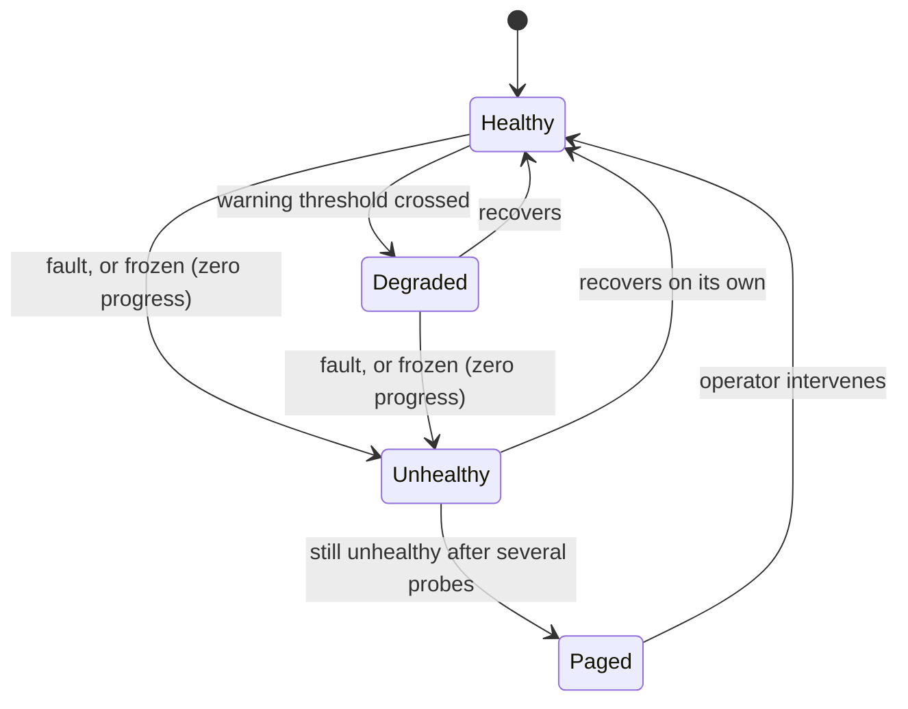

# Meta-Watchdog

> Baldur watches your services. Meta-Watchdog watches Baldur — and pages a human the moment the safety net itself goes quiet.

!!! info "PRO feature"
    Meta-Watchdog is a PRO-tier feature. It answers the question every self-healing system eventually has to face: *"who watches the watchman?"* When the layer that's supposed to protect you silently stops working, nothing tells you — until the incident it was meant to catch reaches production unguarded.

## What is it?

A self-healing framework is itself software, and software fails. The circuit breakers, the dead-letter queue, the recovery workers, the connection to Redis — every piece of Baldur that keeps *your* application healthy can itself stall, freeze, or die, just like anything else running in production.

When that happens *silently*, you end up worse off than if you'd had no safety net at all: you believe you're protected, so you stop watching — and you're not. That false sense of safety is the trap a self-monitoring layer exists to close.

A **watchdog** is a supervisor whose only job is to keep checking that something else is still alive and still making progress, and to sound the alarm when it isn't, the same idea as a hardware watchdog timer that reboots a frozen device. **Meta-Watchdog** is Baldur's watchdog pointed at Baldur: it continuously probes Baldur's own healing subsystems, recognises when one has stopped working — even when it's technically still running — and pages a human.

## Why it matters

The failure this prevents is the quiet one. A crash leaves a stack trace; a stuck system leaves nothing. A recovery worker that's wedged on a lock, a queue that's stopped draining, a circuit breaker frozen open: none of these throw an error, none of them page anyone, and all of them mean your protection is gone while every dashboard still reads green.

Meta-Watchdog turns that silent gap into an explicit, observable signal:

- **It catches "frozen", not just "crashed".** A dead process is easy to spot. The dangerous case is a component that's still up but no longer doing anything: its numbers haven't moved in minutes while errors pile up behind it. Meta-Watchdog treats that *zero-progress* state as a failure in its own right, so a wedged subsystem can't hide behind a live process.
- **It pages once, not once per server.** When the same subsystem is unhealthy across a fleet of workers, you get a single alert for the incident — not one page per process at 3 a.m.
- **It tells the truth about what it did.** The page says plainly that a human is needed and that no automatic recovery was attempted — so on-call knows this is theirs to act on, not something the system is quietly handling.
- **Every page is on the record.** Each escalation is written to a durable event journal and counted as a metric, so "what failed, and when did we hear about it?" is answerable after the fact instead of reconstructed from memory.

## How it works in Baldur

Meta-Watchdog runs as a background loop. On a fixed interval (30 seconds by default) it probes each of Baldur's healing subsystems (the circuit breakers, the dead-letter queue, the recovery pipeline, the Redis connection, the audit system, the chaos scheduler, the notification channels, the precomputed cache, and the error-budget gate) and grades each one:

| Status | Meaning |
|--------|---------|
| **Healthy** | Working normally |
| **Degraded** | Still working, but worth attention (e.g. a growing backlog) |
| **Unhealthy** | Broken or frozen — needs intervention |
| **Unknown** | The probe couldn't determine a status |

The overall health is the *worst* status across all subsystems, so a single broken component is never averaged away by the healthy ones.

**The key trick is detecting "stuck".** Beyond asking "is it up?", Meta-Watchdog watches whether each subsystem is actually *making progress*. If a component's key metric stops changing entirely — its variance falls to essentially zero — while its error rate stays high, it is treated as **stuck** even though the process is alive and answering. A queue pinned at exactly 1,000 pending entries that never drains, or a circuit breaker locked open, fits this pattern. A component that has simply been unhealthy for too long is flagged the same way. This is what lets the watchdog catch the frozen-but-running failures that ordinary up/down health checks miss.

When a subsystem stays unhealthy across several consecutive probes, Meta-Watchdog escalates — it pages a human through your configured channel (Slack or PagerDuty) with a critical-severity alert titled **`Baldur <component> Failure`**. The alert names the failing component, includes the underlying error, and states that manual intervention is required.

Two rules keep the paging sane:

- **One page per incident.** An ongoing failure escalates **once per episode**, not on every probe. The alert clears internally only when the component returns to healthy — so a subsystem that's been broken for an hour doesn't generate an hour of duplicate pages. This holds across every running instance too: a cluster-wide guard ensures one worker pages for a shared failure rather than all of them at once.
- **It always records, even if paging fails.** Every escalation is appended to a durable event journal and emitted as a metric. If the external channel itself can't be reached, the alert is written to a local fallback record so the event is never lost.

**In v1.0, Meta-Watchdog detects and escalates — it does not self-recover.** This is a deliberate choice, not a missing feature. Handing a system the authority to restart its own internals is only safe once the failure modes are well understood, so v1.0 ships the part that is unambiguously safe (*find the problem and tell a human*) and a real person decides what to do. Autonomous recovery is held back behind off-by-default gates until that bar is met.

**Verifying your alerts before you need them.** Because the worst time to discover a misconfigured webhook is during a real incident, an operator can fire an on-demand self-test — `baldur escalation test` on the command line, or the equivalent admin endpoint — which sends a clearly-labelled test notification through every configured channel and reports, per channel, whether it was delivered. It confirms your paging path is live without waiting for something to actually break.

| What you observe | When it happens |
|------------------|-----------------|
| A critical page titled `Baldur <component> Failure` | a healing subsystem stays unhealthy or frozen across several probes |
| The alert states manual intervention is required and no recovery was attempted | v1.0 detect-and-escalate mode (autonomous recovery is deferred) |
| A single alert for one incident, not one per worker | cluster-wide and per-process de-duplication |
| A durable journal entry and a metric increment for each escalation | every time it pages |
| A test alert through every configured channel, with per-channel delivery results | you run the escalation self-test |

## Configuration

Meta-Watchdog is **on by default** under PRO. The most common knobs:

| Env Var | Default | What it controls |
|---------|---------|------------------|
| `BALDUR_META_WATCHDOG_ENABLED` | `true` | Master switch — set to `false` to silence the watchdog entirely |
| `BALDUR_META_WATCHDOG_ESCALATION_ENABLED` | `true` | Whether detections page a human |
| `BALDUR_META_WATCHDOG_PROBE_INTERVAL_SECONDS` | `30` | How often it probes every subsystem |
| `BALDUR_META_WATCHDOG_PAGERDUTY_ROUTING_KEY` | _(none)_ | PagerDuty Events API routing key for critical pages |

The full set of tuning options lives in the [environment variable reference](../../reference/env-vars.md).

## See also

- [Unified Notification](unified-notification.md) — the channel layer Meta-Watchdog's pages are delivered through
- [Audit Trail](audit.md) — where escalation events are durably recorded
- [Getting Started](../../getting-started/index.md) — set Baldur up
- [API Reference](../../reference/index.md) — full options and signatures
- [Environment Variables](../../reference/env-vars.md) — the complete operator-tunable list
