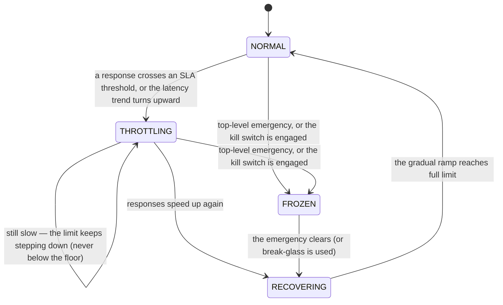

# Adaptive Throttle

> Caps how many requests your service admits, and moves that cap up and down on its own as the
> service speeds up or slows down — so it sheds load *before* it falls over instead of after.

!!! info "PRO feature"
    Adaptive Throttle is a PRO-tier feature. It answers the production question a fixed rate limit
    can never answer: *"what is the right limit right now?"* — when the safe number changes minute
    to minute with the health of everything downstream.

## What is it?

A busy highway on-ramp often has a meter — a small traffic light that releases cars onto the
freeway one at a time. When the freeway is flowing it lets cars on quickly; when traffic is
building it slows the release, because dumping a hundred more cars into a jam only makes the jam
worse. A **rate limiter** is the same idea for a service: it caps how many requests are admitted in
a window and turns the rest away (usually with an HTTP `429 Too Many Requests`), so a flood can't
bury the service.

The catch is the number. A **fixed** limit is a guess frozen in time, and the safe number isn't
fixed. It depends on how fast your database is answering this minute, whether a downstream API is
healthy, how loaded the host is. Set the guess too high and an overload still slips through; set it
too low and you reject traffic the service could easily have handled.

**Adaptive throttling** removes the guess by moving the cap with live evidence. Baldur uses the
Netflix **Gradient** technique: it watches the *trend* in response times and treats a rising trend
as the early warning of an overload. When responses start slowing, it lowers the cap; when they
speed back up, it raises it. In Baldur this is the **Adaptive Throttle** — a self-adjusting
admission limit that floats between a floor and a ceiling you set, steered by the service's own
latency.

## Why it matters

A static rate limit is wrong in two directions at once, and you only find out which during an
incident:

- **Too high.** The limit lets more traffic in than the service can currently handle. Response
  times climb, the slowdown feeds on itself, and the service tips over while the limit sits there
  reporting "plenty of headroom."
- **Too low.** The limit rejects traffic the service could have served. You pay for capacity you
  refuse to use, and real users get `429`s on a perfectly healthy system.

Adaptive Throttle replaces that frozen guess with a limit that tracks reality:

- **It backs off before the cliff, not after.** Reacting to the rising latency *trend* means the
  cap comes down while there is still time — when responses are merely getting slower, not once
  they have already failed.
- **Recovery doesn't cause a second outage.** When the pressure clears, the cap is raised back in
  gradual steps rather than flung wide open, so a recovering service isn't instantly buried by the
  backlog that was waiting on it — the classic "thundering herd" that turns one outage into two.
- **Rejected work isn't thrown away.** A request turned away by the throttle can be parked and
  automatically replayed once the system recovers, so a transient overload costs you latency, not
  lost work.
- **It stays sane when its own coordination store is down.** If the shared limit store becomes
  unreachable, the throttle neither removes the limit (which would let a flood through) nor blocks
  everything — it holds the last known-good limit until the store returns.
- **Your own fleet stops DDoSing your dependencies.** When an upstream you call starts returning
  `429`, every worker would normally retry at once and hammer it (and itself) harder. The built-in
  Rate Limit Coordinator makes the whole fleet back off together instead.

## How it works in Baldur

Throttle works as a two-step loop around each call. Before doing the work you **check** a key (a
user, an IP, a tenant, whatever you want to limit by); the check returns an allow/reject verdict
plus live detail (the current limit, how much is left in the window, the latest response time and
its trend). After the work returns, you hand the throttle the **response time**, which is the
evidence it uses to steer the limit.

The limit itself always lives between a **floor** and a **ceiling** you configure, starting from an
initial value. It never drops below the floor (so the service never throttles itself to a
standstill) and never rises above the ceiling (so it can't admit more than you've decided is safe).
Between those bounds it moves on its own, re-evaluated at most once per sampling interval so it
adjusts smoothly rather than thrashing on every request.

What moves it is the response-time signal, read at two levels:

- **Hard SLA thresholds.** A single response slower than the **critical** threshold (500 ms by
  default) cuts the limit sharply (about 30%) right away — a clear overload doesn't wait for a
  trend. A response past the **warning** threshold (200 ms by default) eases the limit down more
  gently.
- **The trend (gradient).** Even within healthy thresholds, if response times are *rising* the
  limit steps down; if they're *falling* and there's headroom, it creeps back up one step at a
  time. Reacting to the slope is what lets it move before a threshold is ever breached.

The limit moves through a few observable regimes as that signal changes:

**Gradual recovery (dampening).** When the pressure lifts (the dependency's circuit breaker
closes, or an emergency stands down), the throttle does **not** snap the limit straight back to
full. It ramps in stages (roughly 80% → 90% → 100%, about 30 seconds apart). While the ramp is in
progress the gradient keeps computing in the background, but the higher limits it would suggest are
deferred until the ramp completes — so the floodgates open on a schedule, not all at once.

**Rejected requests are preserved.** A request the throttle turns away can be captured — together
with the context needed to run it again — into Baldur's dead-letter queue. When the related circuit
breaker recovers, those parked requests are replayed automatically in batches, once the system has
recovered far enough to take them. A burst that was rejected because the system was briefly
overloaded is run later instead of lost. (This uses the DLQ + Replay subsystem, part of the same
PRO tier.)

**It moves in step with the circuit breaker.** Throttle and the circuit breaker share the same
response-time data. Sustained critical latency that the throttle sees can feed the breaker's
failure detection; and the breaker's state feeds back into the cap — while the breaker is open the
throttle clamps toward its floor, and at half-open it admits only a reduced share — so the two
protections reinforce each other instead of pulling in opposite directions.

**It degrades the right traffic first.** Each check can carry a tier — `critical`, `standard`, or
`non_essential`. When the limit is being pulled down under pressure, critical-tier traffic is held
to the pre-reduction limit, and when the error budget is in trouble, non-essential traffic is the
first to be shed. The cuts land on the least important work.

**It can be frozen, and that's deliberate.** A top-level emergency or an engaged kill switch
**freezes** limit changes: the gradient keeps computing so the throttle is ready to resume the
instant control returns, but it stops *applying* changes while the operator is in control. An
audited break-glass override releases a hard stop and starts the dampened recovery above. Every
SLA-driven limit change is written to the audit trail, so the record of "why did the limit move"
is always there.

### The Rate Limit Coordinator (self-DDoS prevention)

Everything above governs *inbound* traffic — how much the service admits. The **Rate Limit
Coordinator** governs the other direction: the calls *your* service makes to dependencies that can
rate-limit *you*.

When an upstream returns `429`, the naive reaction is for every worker to retry on its own
schedule — which means dozens of workers hammering an already-overwhelmed dependency at the same
moment, a self-inflicted denial of service. The coordinator replaces that with one shared decision:
a single global **cooldown** that every worker observes, using exponential backoff with random
jitter so the retries, when they do come, are spread out rather than synchronized. The first
request sent after a cooldown ends is treated as a **canary** — a single scout that checks whether
the dependency has actually recovered before the rest of the fleet resumes. Wrapping an outbound
call with the coordinator's rate-limit-aware decorator applies all of this automatically: wait if a
cooldown is active, make the call, and arm the next cooldown if it comes back `429`.

### What you see

| What you observe | When it happens |
|------------------|-----------------|
| The admitted limit drops sharply (about 30%) | a response time crosses the critical SLA threshold |
| The admitted limit eases down (about 10%) | a response crosses the warning threshold, or the latency trend is rising |
| The admitted limit creeps up one step | the latency trend is falling and the service has headroom |
| The limit holds steady, still recomputing in the background | a top-level emergency or the kill switch has frozen application |
| The limit ramps back in stages rather than jumping to full | a dependency recovered; the dampened ramp avoids a thundering herd |
| A request is rejected with the current limit, remaining count, and latest latency attached | the in-window count reached the current limit |
| A rejected request runs successfully later | it was captured to the DLQ and auto-replayed on recovery |
| Critical-tier requests keep getting through while others are shed | the limit is being cut under pressure and tiering is protecting critical traffic |
| Outbound calls to a rate-limited dependency all pause, then resume with one scout request first | the Rate Limit Coordinator set a shared cooldown and sent a canary on recovery |
| A limit change appears in the audit trail with the latency and reason behind it | every SLA-driven adjustment is recorded |

The live state — current limit, latest response time and its trend, which regime the throttle is
in, and its recovery progress — is exposed on the admin server and shown in the Web Console's
throttle panel. The same state is exported as Prometheus metrics (the current limit, response time
and gradient, SLA warning/critical events, and the direction, trigger, and size of each limit
change), and lifecycle moments — a limit changed, an SLA threshold crossed, a limit recovered, a
`429` seen, a cooldown ended — are published on Baldur's event bus for anything else that needs to
react.

## Configuration

| Env Var | Default | What it controls |
|---------|---------|------------------|
| `BALDUR_LICENSE_KEY` |  | PRO entitlement (unset in OSS mode) — Adaptive Throttle activates when Baldur initializes with a valid license |
| `BALDUR_REDIS_URL` | `redis://localhost:6379/0` | where the distributed limit and cooldown state are shared across workers; without it the throttle runs per-process |

The limit's shape — the floor, the ceiling, the starting value, the SLA thresholds, the sampling
interval, and the recovery ramp — is set on the throttle when it is created, in code, alongside the
service it protects. The framework-level tuning behind the defaults is advanced / internal for
v1.0: it is not part of the public operator-tunable environment-variable allowlist yet.

## See also

- [Circuit Breaker](../oss/circuit-breaker.md) — stops calling a dependency that keeps failing; Adaptive Throttle shares its latency data and moves its limit in step with the breaker's state
- [DLQ + Replay](dlq-replay.md) — where throttle-rejected requests are parked and from which they are auto-replayed on recovery
- [Emergency Mode](emergency-mode.md) — the severity levels that freeze the throttle's limit changes during an incident
- [Adaptive Throttle API Reference](../../reference/pro/throttle.md) — full options and signatures
- [Admin REST API](../../reference/api-admin.md) — the read-only status surface
- [Getting Started](../../getting-started/index.md) — set Baldur up
- [Environment Variables](../../reference/env-vars.md) — the complete operator-tunable list
