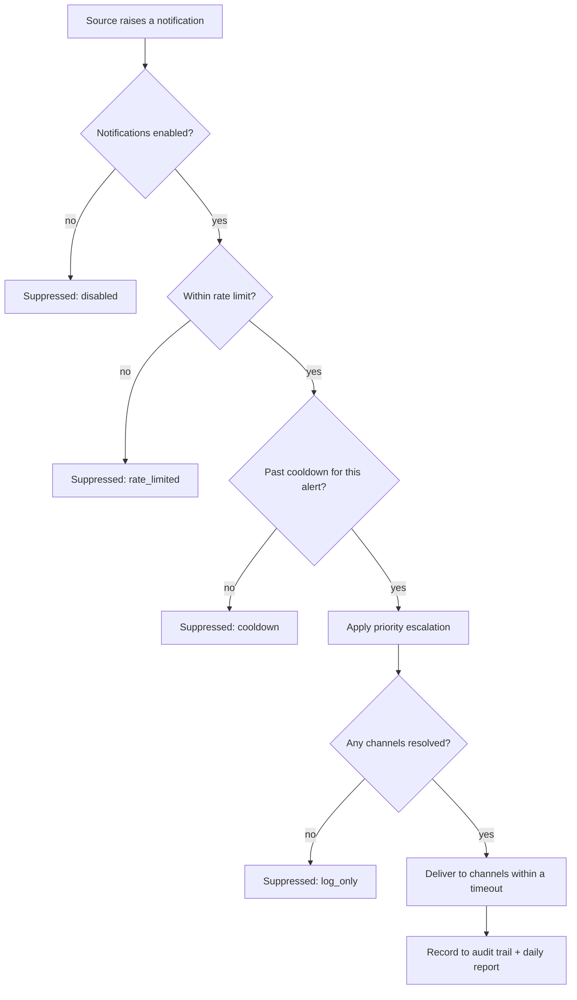

# Unified Notification

> One control point for every alert Baldur raises — so the right people hear about the things that matter, and aren't drowned by the things that don't.

!!! info "PRO feature"
    Unified Notification is a PRO-tier feature. It answers the operational question that shows up the moment a system has more than one thing worth alerting on: *"why are my alerts scattered across five places, why do they all fire at 3 a.m., and why did I miss the one that mattered?"*

## What is it?

As a system grows, the things worth telling a human about multiply: a circuit breaker tripped, an SLA drifted, a security incident fired, a governance gate blocked a change. Left alone, each of these subsystems grows its *own* way of notifying you — its own Slack call here, its own email there — and none of them know the others exist. The result is the classic operations failure mode: alerts fragmented across the codebase, no shared rate limiting, and a flood of duplicates that trains everyone to ignore the channel entirely. The signal that actually mattered arrives in the same noise as a hundred that didn't.

A **notification hub** fixes this by putting one consolidation point between every alert *source* and every delivery *channel*. Sources stop talking to Slack or email directly; they hand a structured message to the hub, and the hub decides where it goes, whether it's a duplicate, and whether anyone is being paged too often. **Unified Notification** is Baldur's name for this hub: a single place that routes, deduplicates, rate-limits, and records every notification the framework raises.

## Why it matters

Without a hub, notification logic is copy-pasted into every subsystem that needs it, and each copy is slightly different. That is fine until you're on call — and then it's the reason you either miss a critical alert or get so many that you mute the channel.

Unified Notification turns that into one deliberate, observable pipeline:

- **One control point, not five.** Every alert source (circuit breakers, SLA monitors, security incidents, governance gates) sends through the same hub. Routing rules, rate limits, and the audit record live in one place instead of being reinvented (and drifting) in each subsystem.
- **No alert fatigue.** Two independent guards keep the channel survivable: a **rate limit** caps how many notifications go out per minute and per hour, and a **cooldown** suppresses repeats of the *same* alert for a configurable window. A storm of identical "circuit breaker still open" messages collapses to one (and that holds across every running instance, not just within a single process) so the channel stays worth reading.
- **The right severity reaches the right channel.** Routing is policy-based: a low-priority operations note can go to Slack only, while a critical security incident fans out to every configured channel: Slack, PagerDuty, or a generic outbound webhook. You decide the policy once; every source inherits it.
- **Critical signals surface during an incident.** When the system is already in trouble, a low-priority notification is exactly the wrong thing to silently batch. During an active emergency, and when one source starts firing repeatedly, the hub **escalates** the priority so the important signal rises above the noise instead of being lost in it.
- **Every notification is on the record.** Each sent notification is written to the audit trail, and operational alerts also feed the daily report — so "what did we alert on, and when?" is answerable after the fact, not reconstructed from memory.

## How it works in Baldur

Any subsystem raises a notification through one of a handful of convenience calls — `notify()` for the general case, plus `notify_security()`, `notify_sla()`, `notify_error()`, and `notify_incident()` for common shapes. Each carries a **priority**, a **category**, and a **source**, and the hub takes it from there. The same message runs the same pipeline no matter which subsystem raised it:

A notification carries a **priority** that decides how far it fans out, and a **category** that decides where it goes:

| Priority | Reaches |
|----------|---------|
| **CRITICAL** | All channels |
| **HIGH** | Slack |
| **MEDIUM** | Slack only |
| **LOW** | Slack only |
| **INFO** | Logged only, unless a channel is configured for it |

Categories (`security`, `operations`, `sla`, `circuit_breaker`, `governance`, `approval`, `report`, `error`, and `chaos`) let you route by *kind* as well as severity. Routing is **category-first**: a category with its own channel policy (say, security alerts always going to a dedicated incident channel) takes precedence, and the priority-based channels are merged in on top. The concrete destinations — which Slack channel, which outbound webhook endpoints — are resolved from your settings, so the same priority can land in different places for different categories.

Alongside the chat and paging channels, a **generic outbound webhook** lets the hub POST Baldur's standard notification envelope to any endpoint you configure — a bridge for custom receivers or in-house tooling that speaks JSON. Any header values you attach to that endpoint (an auth token, say) are treated as secrets and never logged. To reach email or SMS, point a webhook at an operator-run mailer/SMS bridge, or use **PagerDuty**, which owns SMS, email, and phone escalation.

**Two guards prevent alert fatigue**, and when either suppresses a notification the result tells you *why* — `disabled`, `rate_limited`, `cooldown`, or `log_only`:

- **Rate limiting** caps the total outgoing volume on two windows at once — a per-minute and a per-hour budget. Once a budget is spent, further notifications are suppressed until it refills, so a misbehaving source can't flood every channel.
- **Cooldown** suppresses repeats of the *same* alert. Each category has a cooldown window, and notifications are de-duplicated by a key (an explicit dedup key, or the source-and-category pair) — so the second, third, and hundredth copy of one ongoing condition are held back while the first still stands. This deduplication spans every running instance — a fleet of pods reacting to the same condition raises one alert, not one per pod — and if the shared coordination store is briefly unreachable it falls back to per-instance dedup rather than dropping the alert.

**Priority escalation** runs before routing, so an important signal isn't quietly downgraded at the worst time:

- **During an active emergency.** When Baldur's [Emergency Mode](emergency-mode.md) is engaged, low-priority notifications are lifted to a higher floor (the deeper the emergency level, the higher the floor) — because "info" messages during an incident are often the ones you most need to see.
- **On a burst from one source.** The hub counts how often each source fires within a time window. Once a source crosses the warning threshold its low-priority notifications are lifted to HIGH, and once it crosses the critical threshold everything it sends is lifted to CRITICAL — turning "this thing won't stop complaining" into a signal of its own.

**Delivery is bounded and partial-success-aware.** Sending runs under a timeout so a slow or stuck channel can't hang the pipeline, and a notification counts as delivered if it reached *at least one* channel — one dead webhook doesn't fail the whole alert. When delivery fails outright — *no* channel accepted the message — the hub emits a delivery-failure event for each channel that failed so your operational tooling can see it, and the alert's source is **masked** in that event (an email is partially redacted, a webhook URL is stripped to its host) so the failure record doesn't leak personal data or secrets.

After a successful send, the hub records the cooldown, writes the notification to the **audit trail**, and — for operations, SLA, and circuit-breaker categories — adds it to the **daily report**. Both of those are best-effort: if the audit or report write fails, the notification has still been delivered.

| What you observe | When it happens |
|------------------|-----------------|
| An alert from any subsystem is delivered through one consistent pipeline | a source calls `notify()` or one of its variants |
| A notification is held back, and the result names the reason | it's `disabled`, `rate_limited`, suppressed by `cooldown`, or routes to `log_only` |
| A flood of identical alerts collapses to a single delivered message | a cooldown window suppresses the repeats |
| A low-priority alert arrives at a higher priority than it was sent | Emergency Mode is active, or one source has crossed a burst threshold |
| A critical alert fans out across Slack, PagerDuty, and any configured webhook at once | the notification's priority is CRITICAL |
| A delivery-failure event appears (one per failed channel), with the source masked | delivery fails outright — no channel accepts the message |
| The notification shows up in the audit trail and the daily report | the send succeeds (operational categories feed the daily report) |

## Configuration

Unified Notification ships with the PRO tier; the hub is available once PRO is active (set through the standard PRO entitlement, `BALDUR_LICENSE_KEY`) and is a no-op otherwise.

Its operational knobs — the per-minute and per-hour rate limits, the per-category cooldown windows, the channel-routing policy, and the escalation thresholds — ship with production-safe defaults and are **advanced / internal for v1.0**: they are not part of the public operator-tunable environment-variable allowlist yet. The concrete channel destinations (Slack channels, PagerDuty routing) are likewise resolved from settings rather than a public env var at this stage. Operator-tunable promotion of these knobs happens through dedicated proposals in a later release; see the [environment variable reference](../../reference/env-vars.md) for the current public allowlist.

## See also

- [Emergency Mode](emergency-mode.md) — drives the priority escalation that surfaces critical alerts during an incident
- [Audit Trail](audit.md) — where every sent notification is recorded
- [Unified Notification API Reference](../../reference/pro/unified-notification.md) — full options and signatures
- [Eventing, notification & audit interfaces](../../reference/interfaces/eventing_and_notification.md) — the notification and audit adapter contracts
- [Getting Started](../../getting-started/index.md) — set Baldur up
- [Environment Variables](../../reference/env-vars.md) — the complete operator-tunable list
