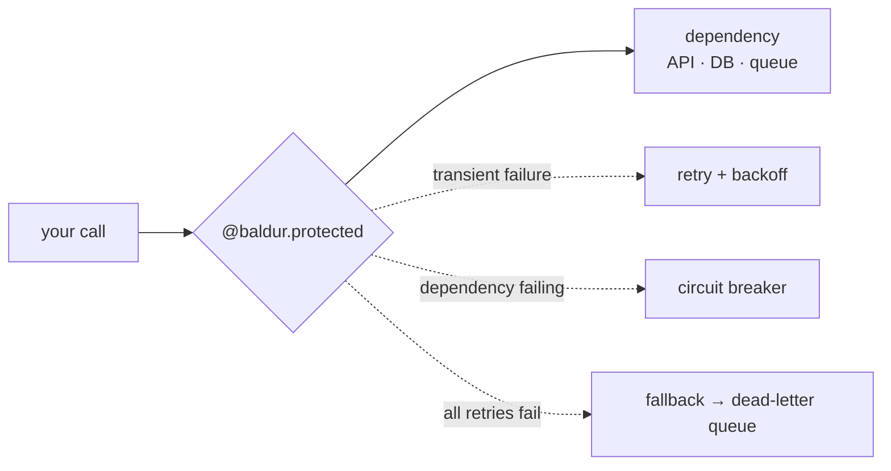

# Baldur

**Baldur** is a self-healing reliability layer for Python applications:
circuit breaker, retry, fallback, and dead-letter queue behind one decorator.

```python
import baldur


@baldur.protected("charge-customer")
def charge(order_id: str) -> dict:
    return payment_gateway.charge(order_id)
```

`@baldur.protected(...)` wraps your function in a composed resilience pipeline.
With zero configuration it runs on an in-memory fallback — no Redis, no
environment variables, no Docker. Add Redis when you go multi-process.



## Why Baldur exists

The failures that actually hurt happen *inside* your service, in the code path of
a single call: a double-charged customer, one slow dependency dragging down every
request, a payment lost to a transient error. Handling them well means writing the
same circuit breaker, the same backoff, the same dead-letter plumbing in every
project, by hand, correctly.

Baldur is that layer, written once and composed behind one decorator:

- **Framework-agnostic.** One API across Django, FastAPI, and Flask.
- **No infrastructure required.** It's a library, not a sidecar or a service.
- **Production-grade when you need it.** Dead-letter queue, replay, and audit are there.

## Get started

Pick your framework and you'll have a protected endpoint running:

- [Getting Started](getting-started/index.md) — Django, FastAPI, or Flask

## License

Baldur is released under the Apache License 2.0.
